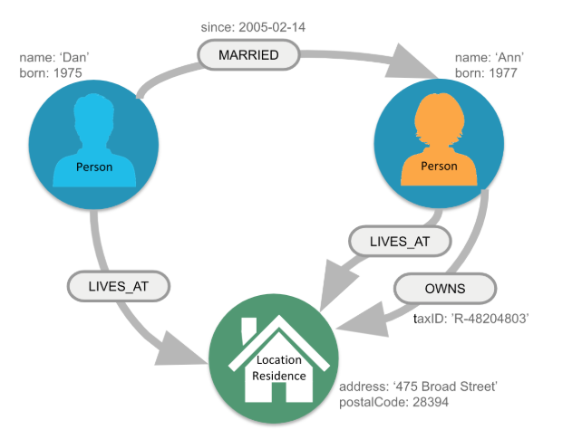
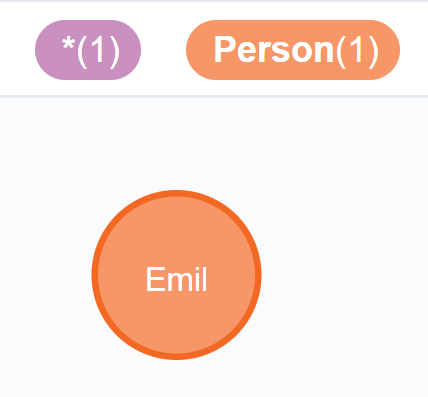
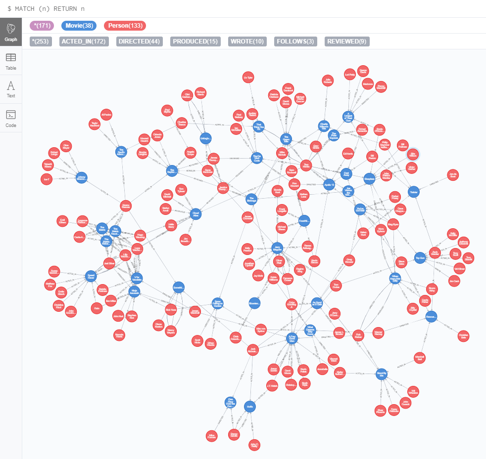
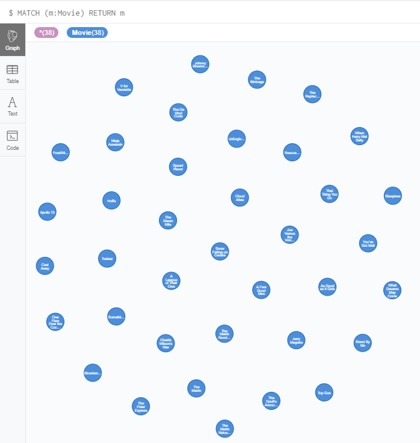
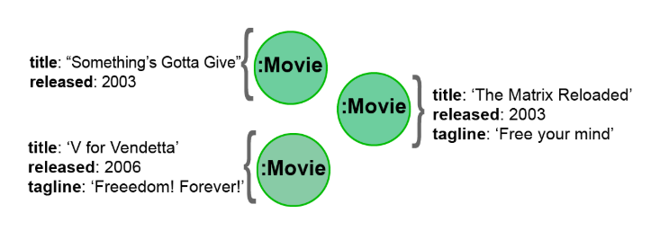
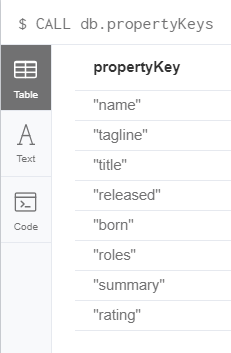
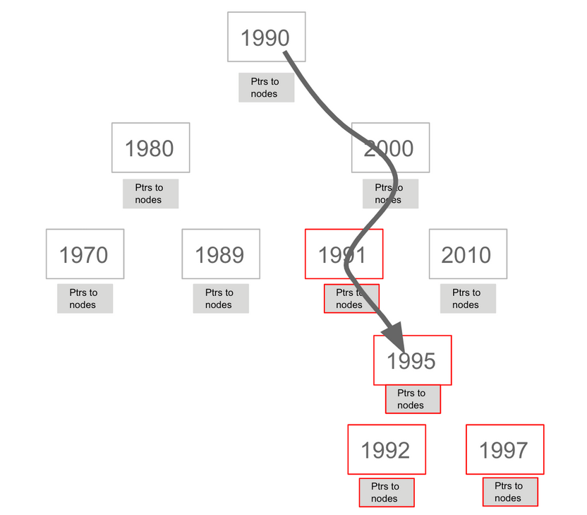
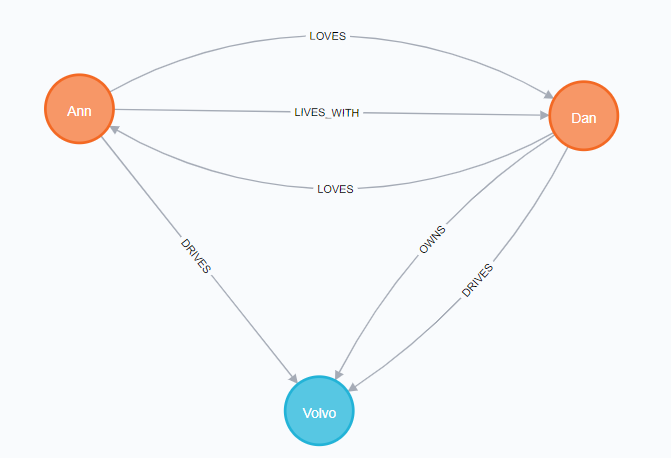
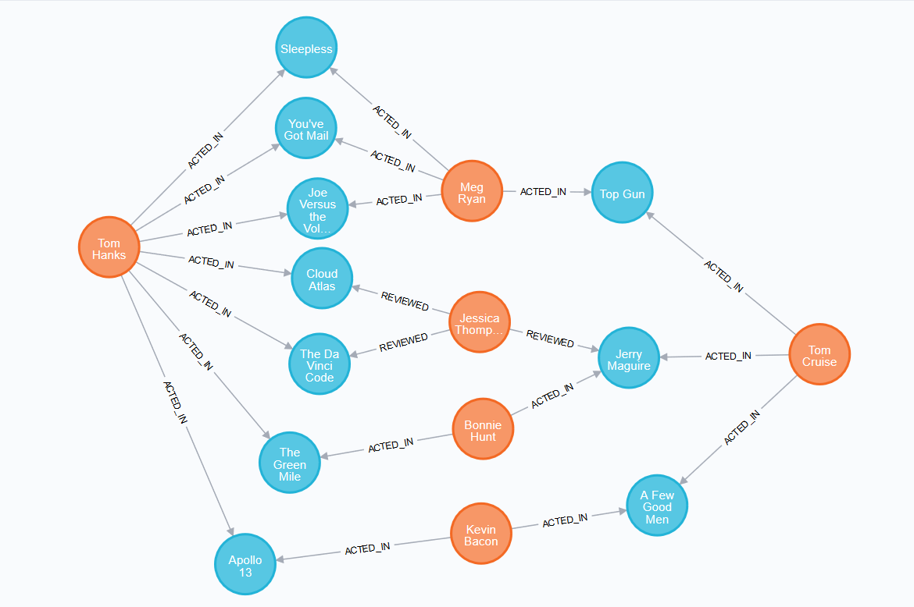
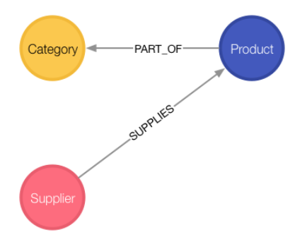

# LearningNeo4j

<!--
TODO
Creating indexes
https://neo4j.com/graphacademy/online-training/introduction-to-neo4j/part-7/
-->

## Content

1. [Graph Database Fundamentals](#graph-database-fundamentals)
2. [Neo4J](#neo4j)
    * [Query Language Cypher](#cypher)
        * [Part one](#part-one)
        * [Part two](#part-two)
        * [Part three](#part-three)
        * [Part four](#part-four)
        * [Part five](#part-five)
        * [Part six](#part-six)
        * [Part seven](#part-seven)
        * [Part eight](#part-eight)
        * [Part nine](#part-nine)
        * [Part ten](#part-ten)
        * [Part eleven](#part-eleven)
        * [Part twelve](#part-twelve)
        * [Part thirteen](#part-thirteen)
        * [Part fourteen](#part-fourteen)
        * [Part fiveteen](#part-fiveteen)
        * [Example](#example---simple-graph)
        * [Application - Movies](#application---movie-graph)
        * [Application - Northwind](#application---northwind-graph)
        * [Recommendations - Movies](#recommendations)
            * [Personalized recommendations](#personalized-reccomendations)
3. [Index](#index)
4. [References](#references)

--------------------

## Graph Database Fundamentals

A graph database can store any kind of data using a few simple concepts:

1. **Nodes** - graph data records

    

2. **Labels** - specifies the type of the node

    

3. **Relationships** - connect nodes

    

4. **Properties** - key-value pair properties

    

The simplest graph has just a single **node** with some named values called **Properties**:


Nodes are the name for data records in a graph and the data is stored as Properties that can be simple key-value pairs.

Nodes can be grouped together by applying a Label to each member. In the example above we can set to that node the label **Person**.  Is important to know that a label is not a object and can't have any properties, is used only to categorize the nodes in a graph. A node can have zero or more labels based on the definition of that node.

To add more records we can simply add more nodes.


Similar nodes can have different properties with different type: string, number or even boolean.
The dimension of a graph like this can be infinite because there is no limit to the number of nodes that can be added.

One of the properties of a database is to connect data, in a graph database the link is made by **Relationships**. To associate two nodes we can add **Relationship** between them wich describe how the records are related.


A relationship are data records that need to have two properties: **direction** and **type**, and can also contains properties like nodes.


A Graph database is an online database management system with Create, Read, Update and Delete (CRUD) operations working on a graph data model.
Graph database are generally build for use with [OLTP](#otlp) systems, they are normally optimized for transactional performance, and engineered with transactional integrity and operational availability in mind.

Unlike the other databases, relationships take first priority in graph databases so the foreign keys or out-of-band processing is no more necessary to link a data to another.

By assembling the simple abstractions of nodes and relationships into connected structures, graph databases enable us to build sophisticated models that map closely to out problem domain.

Many applications' data is modeled as relational data, indeed there are some similarities between a relational model nad a graph model:
|Relational|Graph|
|----|----|
|Rows|Nodes|
|Joins|Relationships|
|Table names|Labels|
|columns|Properties|

There are even difference between this two databases:
|Relational|Graph|
|----|----|
|Each column must have field value|Nodes with the same label arent' required to have the same set of properties|
|Joins are calculated at query time|Relationships are stored on disk when they are created|
|A row can belong to one table|A node can have many labels|
|Try to get the schema defined and then make minimal changes to it after that|It's common for the schema to evolve with the application|
|More abstract focus when modeling|Common to use actual data items when modeling|

Here is the relational model:


And here is the correspondig graph model:


The graph model can be more versatile and can be upgrade without efforts, for example we want to add the confederation and country:


--------------------

## Neo4J


[video youtube](https://www.youtube.com/watch?v=_D19h5s73Co)

Connected information is everywhere in the world around us. Neo4j was build to efficiently store, handle, and query higly-connected data in your data model.

Neo4J is a high performance graph store with all the feature expected of a mature and robust database. The network structure is made by nodes and relationships rather than static tables.

Some definitions:

* Index free adjacency

    With index free adjaceny, when a node or relationship is written to the database, it is stored in the database as connected and any subsequent access to the data is done using pointer navigation wich is very fast. Since Neo4j is a native graph database, it supports very large graphs where connected data can be traversed in constant time without the need for an index.

    

    To know more read -> [Index-free adjacency](#index-free-adjacency)

* ACID

    Transactionality is very important for robust applications that require an atomicity, consistency, isolation, and durability guarantees for their data. If a relationship between nodes is created, not only is the relationship created, but the nodes are updated as connected.
    All of these updates to the database must all succeed or fail.

    

    To know more read -> [ACID](#acid-consistency-model)

* Clusters

    Neo4j supports clusters that provide high availablity, scalability for read access to the data and failover which is important to many enterprises.

    

    To know more read -> [Cluster](#cluster)

* Graph engine

    The Neo4j graph engine is used to interpret Cypher statements and also executes kernel-level code to store and retrive data, whether it is on disk, or cached in memory.

* Bolt

    Neo4j supports Java, JavaScript, Python, C#, and Go drivers that use Neo4j's bolt protocol for binary access to the database layer.
    Bolt is an efficiant binary protocol that compresses data sent over the wire as well encrypting the data.
    It's possible to create a java application that uses the bolt driver to access the Neo4j database and the application may use other packages that allow data integration between Neo4j and other data stores or uses as common framework such as spring.

* Tools

    [Neo4j browser](https://neo4j.com/sandbox-v2/) is an application that uses the JavaScript Bolt driver to access the graph engine of the Neo4j database server.

    [Bloom](https://neo4j.com/bloom/) enables you to visualize a graph without knowing much about Cypher ([youtube video](https://www.youtube.com/watch?v=KjINhGbG-So)).

    [ETL](https://neo4j.com/developer/neo4j-etl/) used to importing and exporting data between flat files and a neo4j Database.


To use Neo4j there are two options:

* [desktop application](https://neo4j.com/developer/neo4j-desktop/)

    " The Neo4j Desktop includes the Neo4j Database server which includes the graph engine and kernel so that Cypher statements can be executed to access a database on your system. It includes an application called Neo4j Browser. Neo4j Browser enables you to access a Neo4j database using Cypher. You can also call built-in procedures that communicate with the database server. There are a number of additional libraries and drivers for accessing the Neo4j database from Cypher or from another programming language that you can install in your development environment. If you are looking to use your system for application development and you want to be able to create multiple Neo4j databases on your machine, you should consider downloading the Neo4j Desktop (free download). The Neo4j Desktop runs on OS X, Linux, and Windows. "

    How to use on:
    1. OSX: [youtube video](https://www.youtube.com/watch?v=8yWhuUnPapw)
    2. Windows: [youtube video](https://www.youtube.com/watch?v=EO57N03U_sI)
    3. Linux: [youtube video](https://www.youtube.com/watch?v=SGH_5x3kfdw)

* [browser sandbox](https://neo4j.com/sandbox-v2/)

    " The Neo4j sandbox is another way that you can begin development with Neo4j. It is a temporary, cloud-based instance of a Neo4j Server with its associated graph that you can access from any Web browser. The database in a Sandbox may be blank or it may be pre-populated. It is started automatically for you when you create the Sandbox.

    By default, the Neo4j sandbox is available for three days, but you can extend it for up to 10 days. If you do not want to install Neo4j Desktop on your system, consider creating a Neo4j sandbox. You must make sure that you extend your lease of the sandbox, otherwise you will lose your graph and any saved Cypher scripts you have created in the sandbox. However, you can use Neo4j Browser Sync to save Cypher scripts from your sandbox. We recommend you use the Desktop for a real development project. The Sandbox is intended as a temporary environment or for learning about the features of Neo4j as well as specific graph use-cases. "

    [youtube video - Creating a Neo4j Sandbox](https://www.youtube.com/watch?v=rmfgRKPjhl8)

Both of them use Neo4j Browser application to perform querying in the database -> [GettingStartedBrowser](https://www.youtube.com/watch?v=rQTximyaETA)

--------------------

### Cypher

***This notes below can be read on neo4J browser sandbox by type the command: :play cypher***

***All of the query are run in the [Neo4J browser sandbox](https://neo4j.com/sandbox-v2) or on [Neo4J desktop](https://neo4j.com/download/)***

Neo4J's Cypher language is purpose built for working with graph data, is a declarative query language that allows for expressive and efficient querying and updating of graph data. It uses patterns to describe graph data and is familiar to sql-like clauses.
This query language allows users to store and retrive data from the Neo4J graph database with a visual and logical syntax to match patterns of nodes and relationships in the graphs.
It allow to state what we want to select, insert, update, or delete from our graph data without a description of exactly how to do it:

#### **" Describing what to find and not how to find it "**

This means that complex database queries can easily be expressed through Cypher, allowing you to focus on your domain instead of getting lost in the syntax of database access. Also give an expressive and efficient queries to handle needed create, read, update, and delete functionality (also know as CRUD operations).

The unwritten rule wants to rappresents the nouns as the nodes of the graph, the verbs as the relationships, the adjectives and adverbs are the properties:


Graph patterns are expressed in Cypher using ASCII-art like syntax to make queries more self-explanatory:

* **NODES** uses a pair of parentheses like `()` or `(node)` to rapresent a node, similar to a circle on witheboard. An anonymous node `()` represents one or more nodes during a query processing where there are no restrictions of the type of the node, a name inside the parentheses `(node)` tells the query processor that for this query is used the variable called `node` to rapresents all the nodes of the graph.
* **LABELS** are used to group nodes and filter queries against the graph and is defined with a colon `(:Label)`. A node can have zero or more labels for example `(node)`, `(node:Label)`, `(node:Label1:Label2)`, `(:Label)`, `(:Label1:Label2)`.
* **RELATIONSHIPS** are defined within square brackets `[]` and optionally we can specify type and direction like `()<-[:RELATIONSHIP]-()`.
* **ALIASES** are used to referred elements to later in the query defined by a name before a name like `(node1:Label1)<-[relationship:RELATIONSHIP]-(node2:Label2)` where node1, node2 and relationship are aliases.
* **Predicates** are filters that can be applied to limit the matching paths: boolean logi operators, [regular expressions](#regular-expressions) and string comparison operators.

The properties of a node are accessed using `{variable}.{property_key}`, for example `emil.name` or `movie.title`.

The Cypher language are case insensitive and sensitive:
|Sensitive|Insensitive|
|---|---|
|Node labels|Cypher keywords|
|Relationship type|-----|
|Property keys|----|

Later on the cypher keywords are upper-case, this is a coding convention and is described in the [Cypher Style Guyide](https://neo4j.com/developer/cypher-style-guide/).

--------------------

### Part one

#### Comments

You can place comments anywhere in the query and to specify that the rest of the line is interpreted as a comment you need to put a double slash `// comment`.

#### Null

Null represents missing or undefined values. You do not store a null value in a property. It just doesen't exist on that particular node.
**Warning: null=null is not true but the result will be null because we don't know the value of a null property**

#### Match

##### ***on neof4j browser run the command `:help MATCH`***

[youtube video - how to execute a MATCH statement](https://www.youtube.com/watch?v=Sz2C618QKN8)

The most widely used Cypher clause is **MATCH**, this performs a pattern match against the data in the graph. During the query processing, the graph engine traverses the graph to find all nodes that match the graph pattern.

A query with match need to be present with the **RETURN** clause. This clause must be the last of a query to the graph. Here some examples:

```Cypher
// returns all nodes in the graph
MATCH (variable)
RETURN variable
```

```Cypher
// returns all Label nodes in the graph
MATCH (variable:Label)
RETURN variable // returns
```

When you specify a pattern for a **MATCH** clause, you should always specify a node label if possible. In doing so, the graph engine uses an index to retrive the nodes which will perform better than not using a label for the **MATCH**.

#### Type of query output

The output of a query can be different:

* by **graph**:



* by **table**:

    ```Json
    {
        "name": "Emil",
        "from": "Sweden",
        "klout": 99
    }
    ```

* by **text**:

    ```Column
    ╒══════════════════════════════════════════╕
    │"ee"                                      │
    ╞══════════════════════════════════════════╡
    │{"name":"Emil","from":"Sweden","klout":99}│
    └──────────────────────────────────────────┘
    ```

#### Exercises part one

***on neof4j browser run the command `:play intro-neo4j-exercises` and follow exercise 1 instructions***

First of all use the script found at [Cypher/exercises/part_one/createGraph.cql](Cypher/exercises/part_one/createGraph.cql) to create the basic graph:

```Text
Added 171 labels, created 171 nodes, set 564 properties, created 253 relationships, completed after 24 ms.
```

Exercise 1.1 Retrive all nodes from the database

```Cypher
MATCH (n)
RETURN n
```



Exercise 1.2 Examine the schema of your database

```Cypher
CALL db.schema()
```


Exercise 1.3 Retrive all Person nodes

```Cypher
MATCH (p:Person)
RETURN p
```


Exercise 1.4 Retrive all Movie nodes

```Cypher
MATCH (m:Movie)
RETURN m
```



--------------------

### Part two

#### Properties

In Neo4j a node can have properties that are used for further define a node.
A property is identified with a key and defined for a node and not for a type of node.
All nodes of the same type need not have the same properties.

For example in the Movie graph all Movie nodes have both title and released properties, however it is not requirement that every Movie node has a property tagline:



Properties can be used to filter queries so that a subset of the graph is retrived. In addition, with the `RETURN` clause, you can return property values from the retrived nodes, rather than the nodes.

The propertiy keys of a graph can be view by execute `CALL db.propertyKeys` which call the Neo4j library method that returns the property keys for the graph.
For example run this command in the movie graph returns the result stream contains all property keys in the graph:



#### Nodes properties filtering

[youtube video - using match to return propery values](https://www.youtube.com/watch?v=Nb9tSFVrQuc)

It's possible to filter the nodes of the graph to a specify a value for a property, any node that matches the value will be retrived.
Here some examples:

```Cypher
MATCH (variable {propertyKey: propertyValue})
RETURN variable
```

```Cypher
MATCH (variable:Label {propertyKey: propertyValue})
RETURN variable
```

```Cypher
MATCH (variable:Label {propertyKey1: propertyValue1, propertyKey2: propertyValue2})
RETURN variable
```

It's possible to retrive a property values of nodes in a query and return on output:

```Cypher
MATCH (variable {property1: value})
RETURN variable.property2
```

```Cypher
MATCH (variable:Label {property1: value})
RETURN variable.property2
```

```Cypher
MATCH (variable:Label {property1: value, property2: value})
RETURN variable.property2, variable.property3
```

In the graph database we can filter the person born on 1970:

```Cypher
MATCH (p:Person {born: 1970})
RETURN p.name, p.born
```

#### Aliases

To customize the headings for a table containing property value it can be use aliases:

```Cypher
MATCH (variable:Label {property1: value, property2: value})
RETURN variable.property2 AS alias1, variable.property3 AS alias2
```

In the graph database we can specify aliases for the returned property values:

```Cypher
MATCH (p:Person {born: 1970})
RETURN p.name AS name, p.born AS `birth year`
```

#### Exercises part two

***on neof4j browser run the command `:play intro-neo4j-exercises` and follow exercise 2 instructions***

First of all use the script found at [Cypher/exercises/part_one/createGraph.cql](Cypher/exercises/part_one/createGraph.cql) to create the basic graph:

```Text
Added 171 labels, created 171 nodes, set 564 properties, created 253 relationships, completed after 24 ms.
```

Exercise 2.1: Retrieve all Movie nodes that have a released property value of 2003.

```Cypher
MATCH (m:Movie {released: 2003})
RETURN m
```

Exercise 2.2: View the retrieved results as a table.

```Cypher
MATCH (m:Movie {released: 2003})
RETURN m
```

Exercise 2.3: Query the database for all property keys.

```Cypher
CALL db.propertyKeys
```

Exercise 2.4: Retrieve all Movies released in a specific year, returning their titles.

```Cypher
MATCH (m:Movie {released: 2006})
RETURN m.title
```

Exercise 2.5: Display title, released, and tagline values for every Movie node in the graph.

```Cypher
MATCH (m:Movie)
RETURN m.title, m.released, m.tagline
```

Exercise 2.6: Display more user-friendly headers in the table.

```Cypher
MATCH (m:Movie)
RETURN m.title AS `Movie title`, m.released AS `Released date`, m.tagline AS `Tag line`
```

--------------------

### Part three

#### Relationships

A relationship is a directed connection between two nodes that has a relationship type (name). In addiction, a relationship can have properties, just like nodes.
In a match clause it's possible to specify nodes and their relationships to traverse the graph and quickly find the data of interest:

* `() // a node`
* `()--() // 2 nodes have some type of relationship`
* `()-->() // the first node has a relationship to the second node`
* `()<--() // the second node has a relationship to the first node`
The relationship can be specified with or without direction.

Here some examples for retrieving a set of nodes that satisfy one or more directed and type relationships:

```Cypher
MATCH (node1)-[:REL_TYPE]->(node2)
RETURN node1, node2
```

```Cypher
MATCH (node1)-[:REL_TYPEA | :REL_TYPEB]->(node2)
RETURN node1, node2
```

Where:
| | |
| ---- | ---- |
| node1, node2 | is a specification of a node where you may include node labels and property values for filtering |
| :REL_TYPE | is the type for the relationship from node1 to node2 |
| :REL_TYPEA, :REL_TYPEB | are the relationships from node1 to node2, the nodes are returned if at least one of the relationships exists |

In the movie graph to retrive the nodes Person that have acted in the Movie "The Matrix" we need to use relationships:

```Cypher
MATCH (node1:Person)-[relation:ACTED_IN]->(node2:Movie {title: "The Matrix"})
RETURN node1, relation, node2
```


There is a build-in function `type()` that returns the relationship type of a relationship.
Here is an example where we use the rel variable to hold the relationships retrived:

```Cypher
MATCH (p:Person)-[rel]->(:Movie {title: "The Matrix"})
RETURN p.name, type(rel)
```

The output list will be:
|p.name|type(rel)|
|---|---|
|"Hugo Weaving"|"ACTED_IN"|
|"Lilly Wachowski"|"DIRECTED"|
|"Laurence Fishburne"|"ACTED_IN"|
|"Lana Wachowski"|"DIRECTED"|
|"Keanu Reeves"|"ACTED_IN"|
|"Carrie-Anne Moss"|"ACTED_IN"|
|"Joel Silver"|"PRODUCED"|
|"Emil Eifrem"|"ACTED_IN"|

Even relationships can have properties, this enables the graph model to provide more data about the relationships between the nodes. Just as can be specify property values for filtering nodes for a query, you can specify property values for a relationships.
Here is an example with the movie graph:

```Cypher
// Returns the name of the person who gave the movie "the da vinci code" a rating of 65
MATCH (p:Person)-[:REVIEWED {rating: 65}]->(:Movie {title: "The Da Vinci Code"})
RETURN p.name
```

Since relationships are directionals queries can have multiple type of matching:

* right direction

    ```Cypher
    MATCH (n)-[r]->(m)
    RETURN n, r, m
    ```

* left direction

    ```Cypher
    MATCH (n)<-[r]-(m)
    RETURN n, r, m
    ```

* both direction

    ```Cypher
    MATCH (n)-[r]-(m)
    RETURN n, r, m
    ```

* traversing relationships

    ```Cypher
    MATCH (n)-[r]->(m)-[p]->(o)
    RETURN n, m, o
    ```

    with query like this it can be usefull to assign a variable to the path and return the path:

    ```Cypher
    MATCH path = (n)-[r]->(m)-[p]->(o)
    RETURN path
    ```

* Centralising relationships

    ```Cypher
    MATCH (n)-[r]->(m)<-[p]-(o)
    RETURN n, m, o
    ```

#### Style recommendations

* Node labels are CamelCase and begin with an upper-case letter, like Person or NetworkAddress.
* Property keys, variables, parameters, aliases, and functions are camelCase and begin with a lower-case letter, like title or businessAddress.
* Relationship type are in upper-case and can use the underscore, like ACTED_IN or FOLLOWS.
* Cypher keywords are upper-case, like MATCH or RETURN.
* String constats are in single quotes, unless the string contains a quote or apostrophe, like 'The Matrix' or "Something's Gotta Give".
* Specify variables only when needed for use later in the cypher statement.
* Place named nodes and relationships before anonymous nodes and relationships in the MATCH clauses when possible.
* Specify anonymous relationships with `-->`, `--`, or `<--`.

#### Exercises part three

***on neof4j browser run the command `:play intro-neo4j-exercises` and follow exercise 3 instructions***

First of all use the script found at [Cypher/exercises/part_one/createGraph.cql](Cypher/exercises/part_one/createGraph.cql) to create the basic graph:

```Text
Added 171 labels, created 171 nodes, set 564 properties, created 253 relationships, completed after 24 ms.
```

Exercise 3.1: Display the schema of the database.

```Cypher
CALL db.schema
```

Exercise 3.2: Retrieve all people who wrote the movie Speed Racer.

```Cypher
MATCH (p:Person)-[:WROTE]->(:Movie {title: "Speed Racer"})
RETURN p
```

Exercise 3.3: Retrieve all movies that are connected to the person, Tom Hanks.

```Cypher
MATCH (m:Movie)--(:Person {name: 'Tom Hanks'})
RETURN m
```

Exercise 3.4: Retrieve information about the relationships Tom Hanks had with the set of movies retrieved earlier.

```Cypher
MATCH (m:Movie)-[relation]-(:Person {name: 'Tom Hanks'})
RETURN m.title, type(relation)
```

Exercise 3.5: Retrieve information about the roles that Tom Hanks acted in

```Cypher
MATCH (m:Movie)-[acted:ACTED_IN]-(:Person {name: 'Tom Hanks'})
RETURN m.title, acted.roles
```

--------------------

### Part four

#### Where

***on neof4j browser run the command `:help WHERE`***

The most common clause to filter queries is `WHERE` that follows a `MATCH` clause.
This clause is the answer for "how we filter the result for a particular match", so this filter all of the nodes and relationships.
In the `WHERE` clause it is possible to place conditions that are evaluated at runtime to filter the query. The potential of this clause is that is possible to specify complex conditions for the query.

Some examples:

1. Example 1

    ```Cypher
    MATCH (m:Movie)
    WHERE m.title = "The Matrix"
    RETURN m
    ```

2. Example 2

    ```Cypher
    MATCH (p:Person)-[:ACTED_IN]->(m:Movie)
    WHERE m.released = 2008
    RETURN p, m
    ```

3. Example 3

    ```Cypher
    MATCH (p:Person)-[:ACTED_IN]->(m:Movie)
    WHERE m.released = 2008 OR m.released = 2009
    RETURN p, m
    ```

This clause accept conditions that return a boolean value of true or false.
It can be use several comparison operators: **=**, **<>**, **<**, **>**, **<=**, **>=**, **IS NULL**, **IS NOT NULL**, **=~**.
There are 4 boolean operators that it can use: **AND**, **OR**, **XOR**, **NOT**.

An example:

```Cypher
MATCH (p:Person)-[r:ACTED_IN]->(m:Movie)
WHERE
    m.released > 2000 OR
    (1994 < m.released <= 1997 AND m.title='As Good as It Gets')
RETURN p.name, m.title, m.released
```

It is opssible to filter node labels in the WHERE clause, for example this two queries:

```Cypher
MATCH (p:Person)
RETURN p.name
```

```Cypher
MATCH (p:Person)-[:ACTED_IN]->(:Movie {title: 'The Matrix'})
RETURN p.name
```

can be rewritten usign WHERE clauses:

```Cypher
MATCH (p)
WHERE p:Person
RETURN p.name
```

```Cypher
MATCH (p)-[:ACTED_IN]->(m)
WHERE p:Person AND m:Movie AND m.title = 'The Matrix'
RETURN p.name
```

Since we are talking about graph database not all the nodes with the same label have the same properties, with the WHERE clause and the build-in function `exists(property)` we can filter the nodes that doesn't have value for the property requested.
For example:

```Cypher
MATCH (p:Person)-[:ACTED_IN]->(m:Movie)
WHERE p.name='Jack Nicholson' AND exists(m.tagline)
RETURN m.title, m.tagline
```

There are also a set of string-related keywords to test string property values: `STARTS WITH`, `ENDS WITH`, and `CONTAINS`.

```Cypher
MATCH (p:Person)-[:ACTED_IN]->()
WHERE p.name STARTS WITH 'Michael'
RETURN p.name
```

[Regular expressions](#regular-expression) can be used to test property values, to specify the request it's necessary to use the **=~** in the condition:

```Cypher
MATCH (p:Person)
WHERE p.name =~'Tom.*'
RETURN p.name
```

The query above retrive all Person nodes with a name property that begins with Tom, the result can be something like this:

|p.name|
|----|
|"Tom Cruise"|
|"Tom Hanks"|
|"Tom Skerritt"|
|"Tom Tykwer"|

Some more filtering for relationships can be used during a query, for example can be possible to use the `NOT` in a `WHERE` clause:

```Cypher
MATCH (p:Person)-[:WROTE]->(m:Movie)
WHERE NOT exists( (p)-[:DIRECTED]->() )
RETURN p.name, m.title
```

This query exclude Person who directed and not wrote the movie.

One more filtering is `IN` that can be used to compare each property with values on the list:

```Cypher
MATCH (p:Person)
WHERE p.born IN [1965, 1970]
RETURN p.name as name, p.born as yearBorn
```

and the return is:
|name|yearBorn|
| --- | --- |
| "Lana Wachowsky" | 1965 |
| "Jay Mohr" | 1970 |
| "River Phoenix" | 1970 |
| "Brooke Langton" | 1970 |

#### Exercises part four

***on neof4j browser run the command `:play intro-neo4j-exercises` and follow exercise 4 instructions***

First of all use the script found at [Cypher/exercises/part_one/createGraph.cql](Cypher/exercises/part_one/createGraph.cql) to create the basic graph:

```Text
Added 171 labels, created 171 nodes, set 564 properties, created 253 relationships, completed after 24 ms.
```

Exercise 4.1: Retrieve all movies that Tom Cruise acted in.

```Cypher
MATCH (tom:Person {name: 'Tom Cruise'})-[:ACTED_IN]-(movie:Movie)
RETURN movie.title
```

or

```Cypher
MATCH (tom:Person)-[:ACTED_IN]-(movie:Movie)
WHERE tom.name = 'Tom Cruise'
RETURN movie.title
```

Exercise 4.2: Retrieve all actors that were born in the 70’s, return name and year born.

```Cypher
MATCH (p:Person)-[:ACTED_IN]->(:Movie)
WHERE 1970 <= p.born <= 1979
RETURN p.name AS Name, p.born AS `Year Born`
```

Exercise 4.3: Retrieve the actors who acted in the movie The Matrix who were born after 1960, return name and year born.

```Cypher
MATCH (act:Person)-[:ACTED_IN]->(m:Movie)
WHERE m.title = 'The Matrix' AND act.born > 1960
RETURN act.name as Name, act.born as `Year Born`
```

Exercise 4.4: Retrieve all movies released in 2000 by testing the node label and released property, return the title of the movie.

```Cypher
MATCH (mov:Movie)
WHERE mov.released = 2000
RETURN mov.title
```

Exercise 4.5: Retrieve all people that wrote movies by testing the relationship between two nodes, return the name of the people and the title of the movie.

```Cypher
MATCH (p)-[rel]->(mov)
WHERE p:Person AND type(rel) ='WROTE' AND mov:Movie
RETURN p.name AS Name, mov.title AS `Movie title`
```

Exercise 4.6: Retrieve all people in the graph that do not have a the born property and return there name.

```Cypher
MATCH (p)
WHERE p:Person AND NOT exists(p.born)
RETURN p.name AS Name
```

Exercise 4.7: Retrieve all people related to movies where the relationship has the rating property, than return their name, movie, title and the rating.

```Cypher
MATCH (p:Person)-[rel]-(m:Movie)
WHERE exists(rel.rating)
RETURN
    p.name AS Name,
    m.title AS `Movie title`,
    rel.rating AS Rating
```

Exercise 4.8: Retrieve all actors whose name begins with James.

```Cypher
MATCH (p:Person)
WHERE p.name =~'James.*'
RETURN p.name
```

or

```Cypher
MATCH (p:Person)
WHERE p.name STARTS WITH 'James'
RETURN p.name
```

Exercise 4.9: Retrieve all all REVIEW relationships from the graph with filtered results.

```Cypher
MATCH ()-[rel:REVIEWED]->(movie:Movie)
WHERE toLower(rel.summary) CONTAINS 'fun'
RETURN
    movie.title as `Movie Title`,
    rel.rating as `Rating`,
    rel.summary as `Summary`
```

Exercise 4.10: Retrieve all people who have produced a movie, but have not directed a movie.

```Cypher
MATCH (a:Person)-[:PRODUCED]->(m:Movie)
WHERE NOT ((a)-[:DIRECTED]->(:Movie))
RETURN a.name, m.title
```

Exercise 4.11: Retrieve the movies and their actors where one of the actors also directed the movie.

```Cypher
MATCH (actor:Person)-[:ACTED_IN]->(mov:Movie)<-[:DIRECTED]-(dir:Person)
WHERE (dir)-[:ACTED_IN]->(mov)
RETURN actor.name, dir.name, mov.title
```

Exercise 4.12: Retrieve all movies that were released in a set of years.

```Cypher
MATCH (m)
WHERE
    m:Movie AND
    m.released IN [2004, 2008, 2000]
RETURN m.title, m.released
```

Exercise 4.13: Retrieve the movies that have an actor’s role that is the name of the movie.

```Cypher
MATCH (act:Person)-[rel:ACTED_IN]->(mov:Movie)
WHERE mov.title in rel.roles
RETURN mov.title, rel.roles
```

--------------------

### Part five

#### Multiple Match patterns

The `MATCH` clause includes a pattern specified by two paths separated by a comma:

```Cypher
MATCH (a:Person)-[:ACTED_IN]->(m:Movie),
    (m:Movie)<-[:DIRECTED]-(d:Person)
WHERE m.released = 2000
RETURN a.name, m.title, d.name
```

#### Setting path variables

It's possible to assign to a variable a path that can be reuse later in the same query or if it's needed to return that path:

```Cypher
MATCH megPath = (meg:Person)-[:ACTED_IN]->(m:Movie)<-[:DIRECTED]-(d:Person),
    (other:Person)-[:ACTED_IN]->(m)
WHERE meg.name = 'Meg Ryan'
RETURN megPath
```

#### Varying lenght paths

Any graph that represents social networking, trees, or hierarchies will most likely have multiple paths of varying lengths.

To get this far you need to use this format `(nodeA)-[:REALTYPE*<number_of_hops>]->(nodeB)` or `(nodeA)-[:REALTYPE*n..m]->(nodeB)` where n and m are the extremes of an interval.

#### Finding the shortest path

A built-in function that you may find useful in a graph that has many ways of traversing the graph to get to the same node is the `shortestPath()` function. Using the shortest path between two nodes improves the performance of the query.

Here an example:

```Cypher
MATCH p = shortestPath((m1:Movie)-[*]-(m2:Movie))
WHERE m1.title = 'A Few Good Men' AND
    m2.title = 'The Matrix'
RETURN p
```

When you use the shortestPath() function, the query editor will show a warning that this type of query could potentially run for a long time. You should heed the warning, especially for large graphs. Read the Graph Algorithms documentation about the shortest path algorithm.

When you use ShortestPath(), you can specify a upper limits for the shortest path. In addition, you should aim to provide the patterns for the from an to nodes that execute efficiently. For example, use labels and indexes.

#### Optional pattern matching

This clause `OPTIONAL MATCH` is just like the `MATCH` but if no matches are found, this clause will use null for missing parts of the pattern.
Here is an examples:

```Cypher
MATCH (p:Person)
WHERE p.name STARTS WITH 'James'
OPTIONAL MATCH (p)-[r:REVIEWED]->(m:Movie)
RETURN p.name, type(r), m.title
```

The return will be a table like this:

| p.name | type(r)|m.title|
| --- | --- | --- |
| "James Marshall"|null|null|
| "James L. Brooks"|null|null|
| "James Cromwell"|null|null|
| "James Thompson"|"REVIEWED"|"The Replacements"|
| "James Thompson"|"REVIEWED"|"The Da Vinci Code"|

#### Aggregation in Cypher

In Cypher is not need to specify a grouping key, all non-aggregated result columns become grouping keys, The grouping is implicity done beased upon the filds in the `RETURN` clause.

For example, in Cypher statement, all rows returned with the same values for a.name and d.name are counted and only return once:

```Cypher
MATCH (a)-[:ACTED_IN]->(m)<-[:DIRECTED]-(d)
RETURN a.name, d.name, count(*)
```

|a.name|d.name|count(*)|
| --- | --- | --- |
|"Emil Eifrem"|"Lana Wachowski"|1|
|"Hugo Weaving"|"Lana Wachowski"|4|
|"Laurence Fishburne"|"Lana Wachowski"|3|
|"Carrie-Anne Moss"|"Lana Wachowski"|3|
|"Keanu Reeves"|"Lana Wachowski"|3|
|"Emil Eifrem"|"Lilly Wachowski"|1|
|"Hugo Weaving"|"Lilly Wachowski"|4|
|"Laurence Fishburne"|"Lilly Wachowski"|3|
|"Carrie-Anne Moss"|"Lilly Wachowski"|3|
|"Keanu Reeves"|"Lilly Wachowski"|3|
|"Al Pacino"|"Taylor Hackford"|1|

This function is very useful when you want to count the number of occurrences of a particular query result.
It's possible to specify the occurrences of an alias `count(n)` and the graph engine calculates the number of occurrences of n.
If we want to calculates the number of rows retrived, including those with `null` values the count argument need to be a *.
Last one is the `count()` without argument and this will implicit group by based upon the aggregation.

There are more aggregating functions such as `min()` or `max()` that can also use in queries.

#### Collecting results

Cypher has a built-in function `collect()` that enables you to aggregate value into a list:

```Cypher
MATCH (p:Person)-[:ACTED_IN]->(m:Movie)
WHERE p.name = 'Tom Cruise'
RETURN collect(m.title) AS `movies for Tom Cruise`
```

And the result will be a list called **movies for Tom Cruise** with the values ["Jerry Maguire", "Top Gun", "A Few Good Men"].

#### Additional processing using `WITH`

During the execution of a `MATCH` clause, is possible to specify some intermediate calculations or values that will be used for further processing of the query, or for limiting the number of results before further processing is done.
With the `WITH` clause it's possible to perform intermediate processing ro data flow operations.

Here is an example:

```Cypher
MATCH (a:Person)-[:ACTED_IN]->(m:Movie)
WITH a, count(a) AS numMovies, collect(m.title) AS movies
WHERE numMovies > 1 AND numMovies < 4
RETURN a.name, numMovies, movies
```

This example return the actors name only if they acted on 2 or 3 movies, with a reference of the numbers of the films and a list of that.

Be carefull with this clause because in the `WITH` body are specify some variables from the previous part of the query that need to be part of the next section of the query, all the aliases for the next part are the only one defined in the body.

Remember to name all expressions with an alias in a `WITH` that are not simple variables.

One more example:

```Cypher
MATCH (p:Person)
WITH p, size((p)-[:ACTED_IN]->(:Movie)) as movies
WHERE movies>=5
OPTIONAL MATCH (p)-[:DIRECTED]->(m:Movie)
RETURN p.name, m.title
```

This is a simple query to retrive all the actor that are acted in at least 5 movies and if they also directed a movie than return the name of that movie.

|p.name|m.title|
| --- | --- |
|"Keanu Reeves"|null|
|"Hugo Weaving"|null|
|"Jack Nicholson"|null|
|"Meg Ryan"|null|
|"Tom Hanks"|"That Thing You Do"|

#### Exercises part five

***on neof4j browser run the command `:play intro-neo4j-exercises` and follow exercise 5 instructions***

First of all use the script found at [Cypher/exercises/part_one/createGraph.cql](Cypher/exercises/part_one/createGraph.cql) to create the basic graph:

```Text
Added 171 labels, created 171 nodes, set 564 properties, created 253 relationships, completed after 24 ms.
```

Exercise 5.1: Write a Cypher query that retrieves all movies that Gene Hackman has acted it, along with the directors of the movies. In addition, retrieve the actors that acted in the same movies as Gene Hackman. Return the name of the movie, the name of the director, and the names of actors that worked with Gene Hackman.

```Cypher
MATCH (gene:Person)-[:ACTED_IN]->(movie:Movie)
WHERE gene.name = 'Gene Hackman'
OPTIONAL MATCH
    (other:Person)-[:ACTED_IN]->(movie),
    (dir:Person)-[:DIRECTED]->(movie)
WITH
    movie,
    collect(other.name) AS Actors,
    collect(dir.name) AS Directors
RETURN
    movie.title AS `Title of movie`,
    Actors AS `Co-Actors`,
    Directors
```

Exercise 5.2: Retrieve all nodes that the person named James Thompson directly has the FOLLOWS relationship in either direction.

```Cypher
MATCH (james:Person)-[:FOLLOWS]-(other:Person)
WHERE james.name = 'James Thompson'
RETURN james, other
```

Exercise 5.3: Modify the query to retrieve nodes that are exactly three hops away.

```Cypher
MATCH (james:Person)-[:FOLLOWS*3]-(other:Person)
WHERE james.name = 'James Thompson'
RETURN james, other
```

Exercise 5.4: Modify the query to retrieve nodes that are one and two hops away.

```Cypher
MATCH (james:Person)-[:FOLLOWS*1..2]-(other:Person)
WHERE james.name = 'James Thompson'
RETURN james, other
```

Exercise 5.5: Modify the query to retrieve particular nodes that are connected no matter how many hops are required.

```Cypher
MATCH (james:Person)-[:FOLLOWS*]-(other:Person)
WHERE james.name = 'James Thompson'
RETURN james, other
```

Exercise 5.6: Write a Cypher query to retrieve all people in the graph whose name begins with Tom and optionally retrieve all people named Tom who directed a movie.

```Cypher
MATCH (tom:Person)
WHERE toLower(tom.name) STARTS WITH 'tom'
OPTIONAL MATCH (tom)-[:DIRECTED]->(movie:Movie)
WITH tom, collect(movie.title) as DirMov
RETURN tom.name AS `Tom* name`, DirMov AS `Directed movies`
```

Exercise 5.7: Retrieve actors and the movies they have acted in, returning each actor’s name and the list of movies they acted in.

```Cypher
MATCH (actor:Person)-[:ACTED_IN]->(movie:Movie)
WITH actor.name AS Actor, collect(movie.title) as Movies
RETURN Actor, Movies
```

Exercise 5.8: Retrieve all movies that Tom Cruise has acted in and the co-actors that acted in the same movie, returning the movie title and the list of co-actors that Tom Cruise worked with.

```Cypher
MATCH (tom:Person {name: "Tom Cruise"})-[:ACTED_IN]->(movie:Movie)<-[:ACTED_IN]-(other:Person)
RETURN movie.title AS `Movie`, collect(other.name) AS `Co-Actors`
```

Exercise 5.9: Retrieve all people who reviewed a movie, returning the list of reviewers and how many reviewers reviewed the movie.

```Cypher
MATCH (reviewer:Person)-[:REVIEWED]->(movie:Movie)
RETURN movie.title AS `Movie`, collect(reviewer.name) AS `reviewers`, count(reviewer) as `Number of reviewers`
```

Exercise 5.10: Retrieve all directors, their movies, and people who acted in the movies, returning the name of the director, the number of actors the director has worked with, and the list of actors.

```Cypher
MATCH (dir:Person)-[:DIRECTED]->(movie:Movie)<-[:ACTED_IN]-(actor:Person)
WITH dir.name as Director, count(actor) as ActorsNumber, collect(actor.name) AS ActorsList
RETURN Director, ActorsList AS `Actors` , ActorsNumber AS `Number of actors`
```

Exercise 5.11: Retrieve the actors who have acted in exactly five movies.

```Cypher
MATCH (actor:Person)-[:ACTED_IN]->(movie:Movie)
WITH actor, count(movie) as movies, collect(movie.title) as moviesList
WHERE movies = 5
RETURN actor.name AS `Name of actor`, moviesList as `Movies`
```

Exercise 5.12: Retrieve the movies that have at least 2 directors, and optionally the names of people who reviewed the movies.

```Cypher
MATCH (dir:Person)-[:DIRECTED]->(movie:Movie)
WITH movie, count(dir) AS numDir
WHERE numDir >= 2
OPTIONAL MATCH (movie)<-[:REVIEWED]-(reviewer:Person)
WITH movie.title AS title, collect(reviewer.name) as listRev
RETURN title, listRev AS `reviewer`
```

--------------------

### Part six

#### Eliminating duplication

To eliminating duplicated results it can be used the `DISTINCT` keyword

This is the exercise 5.1, we can use the DISTINCT clause to avoid repeting the directors in the list:

```Cypher
MATCH (gene:Person)-[:ACTED_IN]->(movie:Movie)
WHERE gene.name = 'Gene Hackman'
OPTIONAL MATCH
    (other:Person)-[:ACTED_IN]->(movie),
    (dir:Person)-[:DIRECTED]->(movie)
WITH
    movie,
    collect(other.name) AS Actors,
    collect(DISTINCT dir.name) AS Directors
RETURN
    movie.title AS `Title of movie`,
    Actors AS `Co-Actors`,
    Directors
```

This clause can be use in several uses, like this:

```Cypher
MATCH (p:Person)-[:DIRECTED | :ACTED_IN]->(m:Movie)
WHERE p.name = 'Tom Hanks'
WITH DISTINCT m
RETURN m.released, m.title
```

#### Ordering result

If you want the results to be sorted, you specify the expression to use for the sort usign the `ORDER BY` keyword and whether you want the order to be descending using the `DESC` keyword. Ascending order is the default.
It can be use multiple sort expressions and the result will be sorted in that order.

This is an example where there is a specification for the release date of the movies for Tom Hanks:

```Cypher
MATCH (p:Person)-[:DIRECTED | :ACTED_IN]->(m:Movie)
WHERE p.name = 'Tom Hanks' AND m.released >= 2000
RETURN m.released, collect(DISTINCT m.title) AS movies ORDER BY m.released DESC
```

|m.released|movies|
| --- | --- |
|2012|["Cloud Atlas"]|
|2007|["Charlie Wilson's War"]|
|2006|["The Da Vinci Code"]|
|2004|["The Polar Express"]|
|2000|["Cast Away"]|

#### Limiting the number of results

Although you can filter queries to reduce the number of results returned, you may also want to limit the number of results. This is useful if you have very large result sets and you only need to see the beginning or end of a set of ordered results.
`LIMIT` is the right choice to do something like this.

Example:

```Cypher
MATCH (m:Movie)
RETURN m.title as title, m.released as year
ORDER BY m.released DESC
LIMIT 10
```

#### Exercises part six

***on neof4j browser run the command `:play intro-neo4j-exercises` and follow exercise 6 instructions***

First of all use the script found at [Cypher/exercises/part_one/createGraph.cql](Cypher/exercises/part_one/createGraph.cql) to create the basic graph:

```Text
Added 171 labels, created 171 nodes, set 564 properties, created 253 relationships, completed after 24 ms.
```

Exercise 6.1: You want to know what actors acted in movies in the decade starting with the year 1990. First write a query to retrieve all actors that acted in movies during the 1990s, where you return the released date, the movie title, and the collected actor names for the movie. For now do not worry about duplication.

```Cypher
MATCH (per:Person)-[:ACTED_IN]->(mov:Movie)
WHERE 1990 <= mov.released < 2000
RETURN mov.released, mov.title, collect(per.name)
```

Exercise 6.2: Modify the query to eliminate duplication.

```Cypher
MATCH (per:Person)-[:ACTED_IN]->(mov:Movie)
WHERE 1990 <= mov.released < 2000
RETURN mov.released, collect(mov.title), collect(per.name)
```

Exercise 6.3: Modify the query to eliminate more duplication.

```Cypher
MATCH (per:Person)-[:ACTED_IN]->(mov:Movie)
WHERE 1990 <= mov.released < 2000
RETURN mov.released, collect(DISTINCT mov.title), collect(DISTINCT per.name)
```

Exercise 6.4: Sort results returned.

```Cypher
MATCH (per:Person)-[:ACTED_IN]->(mov:Movie)
WHERE 1990 <= mov.released < 2000
RETURN mov.released, collect(DISTINCT mov.title), collect(DISTINCT per.name)
ORDERED BY mov.released DESC
```

Exercise 6.5: Retrieve the top 5 ratings and their associated movies.

```Cypher
MATCH (:Person)-[rel:REVIEWED]->(mov:Movie)
RETURN mov.title, rel.rating as rat
ORDER BY rat DESC
LIMIT 5
```

Exercise 6.6: Retrieve all actors that have not appeared in more than 3 movies.

```Cypher
MATCH (act:Person)-[:ACTED_IN]->(mov:Movie)
WITH act, count(mov) AS numberMovies, collect(mov.title) AS movies
where numberMovies <= 3
RETURN act.name, movies
```

--------------------

### Part Seven

#### List

There are many build-in Cypher functions that you can use to build or access elements in lists.
A Cypher `map` is list of key/value pairs where each element of the list is of the format key: value.

It's possible to collect values for a list during a query and with this it's possible to sort by the size of the list using the `size()` function as follows:

```Cypher
MATCH (a:Person)-[:ACTED_IN]->(m:Movie)
WITH m, count(m) AS numCast, collect(a.name) AS cast
RETURN m.title, cast, numCast
ORDER BY size(cast)
```

#### Unwinding lists

There my be some situations where you want to perform the opposite of collecting results, but rather separate the lists into separate rows.
This functionality is done using the unwind clause.

Here is an example where we create a list with three elements, unwind the list and then return the values. Since there are three elements, three rows are returned with the values:

```Cypher
WITH [1, 2, 3] AS list
UNWIND list AS row
RETURN row, list
```

and the result will be:

| row | list |
| --- | --- |
| 1 | [1,2,3] |
| 2 | [1,2,3] |
| 3 | [1,2,3] |

The `unwind` clause is frequently used when importing data into a graph.

#### Dates

Cypher has a built-in `date()` function, as well as other temporal values and functions that you can use to calculate temporal values.
You use a combination of numeric, temporal, spatial, list and string functions to calculate values that are useful to your application.

For example we want to calculate all the age value of the actors given the born year:

```Cypher
MATCH (actor:Person)-[:ACTED_IN]->(:Movie)
WHERE exists(actor.born)
WITH DISTINCT actor, date().year - actor.born AS age
RETURN actor.name, age AS `age today`
ORDER BY actor.born DESC
```

#### Exercises part seven

***on neof4j browser run the command `:play intro-neo4j-exercises` and follow exercise 7 instructions***

First of all use the script found at [Cypher/exercises/part_one/createGraph.cql](Cypher/exercises/part_one/createGraph.cql) to create the basic graph:

```Text
Added 171 labels, created 171 nodes, set 564 properties, created 253 relationships, completed after 24 ms.
```

Exercise 7.1: Write a Cypher query that retrieves all actors that acted in movies, and also retrieves the producers for those movies. During the query, collect the names of the actors and the names of the producers. Return the movie titles, along with the list of actors for each movie, and the list of producers for each movie making sure there is no duplication of data. Order the results returned based upon the size of the list of actors.

```Cypher
MATCH (act:Person)-[:ACTED_IN]->(mov:Movie)<-[:PRODUCED]-(prod:Person)
WITH mov, collect(act.name) AS actList, collect(DISTINCT prod.name) AS prodList
RETURN mov.title AS `Title`, actList AS `Actors`, prodList AS `Producers`
ORDER BY size(actList) DESC
```

Exercise 7.2: Write a Cypher query that retrieves all actors that acted in movies, and collects the list of movies for any actor that acted in more than five movies. Return the name of the actor and the list.

```Cypher
MATCH (act:Person)-[:ACTED_IN]->(mov:Movie)
WITH act, collect(mov.title) as movs
WHERE size(movs) > 5
RETURN act.name AS `Name`, movs AS `Movies`
```

Exercise 7.3: Modify the query you just wrote so that before the query processing ends, you unwind the list of movies and then return the name of the actor and the title of the associated movie

```Cypher
MATCH (act:Person)-[:ACTED_IN]->(mov:Movie)
WITH act, collect(mov.title) as movs
WHERE size(movs) > 5
UNWIND movs as movie
RETURN act.name, movie
```

Exercise 7.4: Write a query that retrieves all movies that Tom Hanks acted in, returning the title of the movie, the year the movie was released, the number of years ago that the movie was released, and the age of Tom when the movie was released.

```Cypher
MATCH (tom:Person)-[:ACTED_IN]->(mov:Movie)
WHERE tom.name = "Tom Hanks"
WITH mov, date().year - mov.released AS yearsAgo, mov.released - tom.born AS yearTom
RETURN mov.title, mov.released, yearsAgo, yearTom
ORDER BY yearsAgo
```

--------------------

### Part Eight

#### Create

##### ***on neof4j browser run the command `:help CREATE`***

Recall that a node is an element of a graph representing a domain entity that has zero or more labels, properties, and relationships to or from other nodes in the graph.

When you create a node, you can add it to the graph without connecting it to another node.

Here is the simplified syntax for creating a node:

```Cypher
CREATE (optionalVariable optionalLabels {optionalProperties})
```

Let's create a small social graph using this query language.

If you plan on referencing the newly created node, you must provide a variable. Whether you provide labels or properties at node creation time is optional.
In most cases, you will want to provide some label and property values for a node when created. This will enable you to later retrive the node. Provided you have a reference to the node.

Here some examples:

* 1 -> Create node of type *Movie* with the *title Batman Begins*:

    ```Cypher
    CREATE  (:Movie {title: 'Batman Begins'})
    ```

* 2 -> Create a node with two labels to the graph of types *Movie* and *Action* with the *title Batman Begins*:

    ```Cypher
    CREATE (:Movie:Action {title: 'Batman Begins'})
    ```

* 3 -> Create the same node of example 2 and return the title:

    ```Cypher
    CREATE (m:Movie:Action {title: 'Batman Begins'})
    RETURN m.title
    ```

* 4 -> Create the same node but with more properties:

    ```Cypher
    CREATE (:Movie:Action {title: 'Batman Begins', released: 2005})
    ```

When the graph engine creates a node, it automatically assigns a read-only, unique ID to the node but this value is not accessible like the other properties but is an internal value.

If all of this 4 queries are execute, this will generate 4 differents nodes this is because the graph engine will create a node with the same properties of a node that already exists. To prevent this "*issue*" you can use the **MERGE** clause rather than **CREATE** or you can add constraints to the graph.

#### More create at once

**Create** clauses can create many nodes at once:

```Cypher
CREATE
(:Person {name: 'Michael Caine', born: 1933}),
(:Person {name: 'Liam Neeson', born: 1952})

CREATE
(:Person {name: 'Katie Holmes', born: 1978}),
(:Person {name: 'Benjamin Melniker', born: 1913})
```

There are two ways to create multiple nodes at once: by separating the nodes specified with commas, or by specifying multiple CREATE statements.

#### Add and remove the labels

***on neof4j browser run the command `:help SET`***

Obviously it can be added more lable or lables for a node before it's creations using the **SET** clause.

Adding 1 label to the x node:

```Cypher
SET x:Label
```

Adding 2 labels to the x node:

```Cypher
SET x:Label1:Label2
```

The **SET** processing is ignored if that label already exists in that node.

Example:

```Cypher
MATCH (m:Movie)
WHERE m.title = 'Batman Begins`
SET m:Action
RETURN labels(m)
```

*This query used the build-in function `label()` that return the set of labels for the node*

It's possible to remove labels from a node by using the **REMOVE** clause with the same syntax of the **SET** clause.

Example: Remove the Action label from the previous created node.

```Cypher
MATCH (m:Movie:Action)
WHERE m.title = 'Batman Begins'
REMOVE m:Action
RETURN labels(m)
```

#### Adding properties to a node

The **SET** clause can be use even to add properties to a node.

Some examples:

```Cypher
SET x.propertyName = value
```

```Cypher
SET x.propertyName1 = value1, x.propertyName2 = value2
```

```Cypher
SET x = {propertyName1: value1, propertyName2: value2}
```

```Cypher
SET x += {propertyName1: value1, propertyName2: value2}
```

If the property does not exist, it is added to the node. If the property exists, its value is updated. If the value specified is `null`, the property is removed.

The type of data for a property is not enforced, so you can assign a string value to a property that was once a numeric value and visa versa.

When the assignment used is the `=` than the properties and their values must exists and their values are overwritten; however `+=` is used to update if exists already, alternatively the properties and values are created.

Example: Add the properties *released* and *lengthInMinutes* to the movie *Batman Begins*.

```Cypher
MATCH (m:Movie)
WHERE m.title = 'Batman Begins'
SET m.released = 2005, m.lengthInMinutes = 140
RETURN m
```

```Cypher
MATCH (m:Movie)
WHERE m.title = 'Batman Begins'
SET  m = {title: 'Batman Begins',
          released: 2005,
          lengthInMinutes: 140,
          videoFormat: 'DVD',
          grossMillions: 206.5}
RETURN m
```

```Cypher
MATCH (m:Movie)
WHERE m.title = 'Batman Begins'
SET m += {
        grossMillions: 300,
        awards: 66
        }
RETURN m
```

#### Removing properties from a node

There are two ways that you can remove a property from a node:

1. Using the **REMOVE** keyword:

    ```Cypher
    REMOVE x.propertyName
    ```

2. Set the property's value to `null`

    ```Cypher
    SET x.propertyName = null
    ```

For example if we want to remove the video format and the gross millions from the batman begins film we can execute this query:

```Cypher
MATCH (m:Movie)
WHERE m.title = 'Batman Begins'
SET m.grossMillions = null
REMOVE m.videoFormat
RETURN m
```

#### Exercises part eight

***on neof4j browser run the command `:play intro-neo4j-exercises` and follow exercise 8 instructions***

First of all use the script found at [Cypher/exercises/part_one/createGraph.cql](Cypher/exercises/part_one/createGraph.cql) to create the basic graph:

```Text
Added 171 labels, created 171 nodes, set 564 properties, created 253 relationships, completed after 24 ms.
```

Exercise 8.1: Create a Movie node for the movie with the title, Forrest Gump.

```Cypher
CREATE (:Movie {title: 'Forrest Gump'})
```

Exercise 8.2: Retrieve the newly-created node.

```Cypher
MATCH (forrest:Movie {title: 'Forrest Gump'})
RETURN forrest
```

Exercise 8.3: Create a Person node for the person with the name, Robin Wright.

```Cypher
CREATE (rob:Person {name: 'Robin Wright'})
```

Exercise 8.4: Retrieve the newly-created node.

```Cypher
MATCH (rob:Person {name: 'Robin Wright'})
RETURN rob
```

Exercise 8.5: Add the label OlderMovie to any Movie node that was released before 2010.

```Cypher
MATCH (oldMov:Movie)
WHERE oldMov.released < 2010
SET oldMov:OlderMovie
RETURN DISTINCT labels(oldMov)
```

Exercise 8.6: Retrieve all older movie nodes to test that the label was indeed added to these nodes.

```Cypher
MATCH (old:OlderMovie)
RETURN old.title, old.released
ORDER BY old.released DESC
```

Exercise 8.7: Add the label Female to all Person nodes that has a person whose name starts with Robin.

```Cypher
MATCH (female:Person)
WHERE female.name STARTS WITH 'Robin'
SET female:Female
RETURN DISTINCT labels(female)
```

Exercise 8.8: Retrieve all Female nodes.

```Cypher
MATCH (female:Female)
RETURN female
```

Exercise 8.9: We’ve decided to not use the Female label. Remove the Female label from the nodes that have this label.

```Cypher
MATCH (female:Female)
REMOVE female:Female
RETURN female
```

Exercise 8.10: View the current schema of the graph.

```Cypher
CALL db.schema
```

Exercise 8.11: Add the following properties to the movie, Forrest Gump: `released: 1994`, `tagline: Life is like a box of chocolates…​you never know what you’re gonna get.`, `lengthInMinutes: 142`,

```Cypher
MATCH (mov:Movie {title: 'Forrest Gump'})
SET mov += {
    released: 1994,
    tagline: 'Life is like a box of chocolates…​you never know what you’re gonna get.',
    leghtInMinutes: 142
}
SET mov:OlderMovie
```

Exercise 8.12: Retrieve this OlderMovie node to confirm that the properties and label have been properly set.

```Cypher
MATCH (p:OlderMovie)
WHERE p.title = 'Forrest Gump'
RETURN p
```

Exercise 8.13: Add the following properties to the person, Robin Wright: `born: 1966` and `birthPlace: Dallas`

```Cypher
MATCH (rob:Person)
WHERE rob.name = 'Robin Wright'
SET rob += {
    born: 1996,
    birthPlace: "Dallas"
}
RETURN rob.born, rob.birthPlace
```

Exercise 8.14: Retrieve this Person node to confirm that the properties have been properly set.

```Cypher
MATCH (rob:Person {name: 'Robin Wright'})
RETURN rob
```

Exercise 8.15: Remove the lengthInMinutes property from the movie, Forrest Gump.

```Cypher
MATCH (mov:Movie {title: 'Forrest Gump'})
SET mov.legthInMinutes = null
return mov
```

Exercise 8.16: Retrieve the Forrest Gump node to confirm that the property has been removed.

```Cypher
MATCH (mov:Movie {title: 'Forrest Gump})
return mov
```

Exercise 8.17: Remove the birthPlace property from the person, Robin Wright.

```Cypher
MATCH (rob:Person)
WHERE rob.name = 'Robin Wright'
REMOVE rob.birthPlace
RETURN rob
```

Exercise 8.18: Retrieve the Robin Wright node to confirm that the property has been removed.

```Cypher
MATCH (rob:Person)
WHERE rob.name = 'Robin Wright'
RETURN rob
```

--------------------

### Part Nine

#### Creating relationships

The relationships are created by defined the left node `x` and the right node `y`:

```Cypher
CREATE (x)<-[:NAME_OF_RELATIONSHIP {name_of_property: value_of_property}]-(y)
```

```Cypher
CREATE (x)-[:NAME_OF_RELATIONSHIP {name_of_property: value_of_property}]->(y)
```

When a relationship is created it must have a direction unlike the non creational queries.
The connections capture the semantic relationships and context of the nodes in the graph.

In most cases, unless you are connecting nodes at creation time, you will retrive the two nodes, each with their own variables, for example, by specifying a **`WHERE`** clause to fine them, and then use the variables to connect them.

Here is an example: Creation of a relationship between Michael Caine with the movie Batman Begins

```Cypher
MATCH (a:Person), (m:Movie)
WHERE a.name = 'Michael Caine' AND m.title = 'Batman Begins'
CREATE (a)-[:ACTED_IN]->(m)
RETURN a, m
```

Another example is the creation of multiple relationships at once bu simply providing the pattern for the creation that includes the relationship types, their directions and the nodes that you want ot connect.

```Cypher
MATCH (a:Person), (m:Movie), (p:Person)
WHERE a.name = 'Liam Neeson' AND
      m.title = 'Batman Begins' AND
      p.name = 'Benjamin Melniker'
CREATE (a)-[:ACTED_IN]->(m)<-[:PRODUCED]-(p)
RETURN a, m, p
```

#### Adding properties to relationships

Just like the adding properties to a node, the same is for the relationships.

```Cypher
SET relationship.propertyName = value
```

```Cypher
SET relationship.propertyName1 = value1 , relationship.propertyName2 = value2
```

```Cypher
SET r = {propertyName1: value1, propertyName2: value2}
```

```Cypher
SET r += {propertyName1: value1, propertyName2: value2}
```

The same rules of adding properties node is apply to the properties of relationships.

Here is an example: Add the `roles` property to the ACTED_IN relationship from *Christian Bale* to *Batman Begins* right after creation of the relationship.

```Cypher
MATCH (act:Person), (mov:Movie)
WHERE act.name = 'Christian Bale' AND mov.title = 'Batman Begins'
CREATE (act)-[rel:ACTED_IN]->(mov)
SET rel.roles = ['Bruce Wayne', 'Batman']
RETURN act, rel, mov
```

To prevent the useless executions of create and set it can be possible to add a condition:

```Cypher
MATCH (act:Person), (mov:Movie)
WHERE act.name = 'Christian Bale' AND
      mov.title = 'Batman Begins' AND
      NOT exists((a)-[:ACTED_IN]->(MOV))
CREATE (act)-[rel:ACTED_IN]->(mov)
SET rel.roles = ['Bruce Wayne', 'Batman']
RETURN act, rel, mov
```

#### Removing properties to relationships

Same as removing properties from nodes it can be possible to remove properties from relationships.

Example:

```Cypher
MATCH (a:Person)-[rel:ACTED_IN]->(m:Movie)
WHERE a.name = 'Christian Bale' AND
      m.title = 'Batman Begins'
REMOVE rel.roles
RETURN a, rel, m
```

#### Exercises part nine

***on neof4j browser run the command `:play intro-neo4j-exercises` and follow exercise 9 instructions***

First of all use the script found at [Cypher/exercises/part_one/createGraph.cql](Cypher/exercises/part_one/createGraph.cql) to create the basic graph:

```Text
Added 171 labels, created 171 nodes, set 564 properties, created 253 relationships, completed after 24 ms.
```

Exercise 9.1: Create the ACTED_IN relationship between the actors, Robin Wright, Tom Hanks, and Gary Sinise and the movie, Forrest Gump.

```Cypher
MATCH (mov:Movie)
WHERE mov.title = 'Forrest Gump'
MATCH (act:Person)
WHERE act.name = 'Robin Wright' OR
      act.name = 'Tom Hanks' OR
      act.name = 'Gary Sinise'
CREATE (act)-[:ACTED_IN]->(mov)
RETURN act, mov
```

Exercise 9.2: Create the DIRECTED relationship between Robert Zemeckis and the movie, Forrest Gump.

```Cypher
MATCH (act:Person), (mov:Movie)
WHERE mov.title = 'Forrest Gump' AND
      act.name = 'Robert Zemeckis'
CREATE (act)-[rel:DIRECTED]->(mov)
RETURN act, rel, mov
```

Exercise 9.3: Create a new relationship, HELPED from Tom Hanks to Gary Sinise.

```Cypher
MATCH (tom:Person), (gar:Person)
WHERE tom.name = 'Tom Hanks' AND gar.name = 'Gary Sinise'
CREATE (tom)-[rel:HELPED]->(gar)
RETURN tom, rel, gar
```

Exercise 9.4: Write a Cypher query to return all nodes connected to the movie, Forrest Gump, along with their relationships.

```Cypher
MATCH (pers:Person)-[rel]-(mov:Movie)
WHERE mov.title = 'Forrest Gump' AND exists(rel)
RETURN pers,rel, mov
```

Exercise 9.5: Add the roles property to the three ACTED_IN relationships that you just created to the movie, Forrest Gump using this information: Tom Hanks played the role, Forrest Gump. Robin Wright played the role, Jenny Curran. Gary Sinise played the role, Lieutenant Dan Taylor.

```Cypher
MATCH (actor:Person)-[rel:ACTED_IN]->(mov:Movie)
WHERE mov.title = 'Forrest Gump'
SET rel.roles = CASE actor.name
                    WHEN 'Tom Hanks'
                        THEN ['Forrest Gump']
                    WHEN 'Robin Wright'
                        THEN ['Jenny Curran']
                    WHEN 'Gary Sinise'
                        THEN ['Lieutenant Dan Taylor']
                END
RETURN actor, rel, mov
```

Exercise 9.6: Add a new property, research to the HELPED relationship between Tom Hanks and Gary Sinise and set this property’s value to war history.

```Cypher
MATCH (tom:Person)-[rel:HELPED]->(gar:Person)
WHERE tom.name = 'Tom Hanks' AND gar = 'Gary Sinise'
SET rel.research = 'war history'
```

Exercise 9.7: View the current list of property keys in the graph.

```Cypher
CALL db.propertyKeys
```

Exercise 9.8: View the current schema of the graph.

```Cypher
CALL db.schema
```

Exercise 9.9: Query the graph to return the names and roles of actors in the movie, Forrest Gump.

```Cypher
MATCH (act:Person)-[rel:ACTED_IN]->(mov:Movie)
WHERE mov.title = 'Forrest Gump'
RETURN act.name, rel.roles
```

Exercise 9.10: Query the graph to retrieve information about any HELPED relationships.

```Cypher
MATCH (pers:Person)-[help:HELPED]->(someone:Person)
RETURN pers.name, help, someone.name
```

Exercise 9.11: Modify the role that Gary Sinise played in the movie, Forrest Gump from Lieutenant Dan Taylor to Lt. Dan Taylor.

```Cypher
MATCH (:Person {name: 'Gary Sinise'})-[rel:ACTED_IN]->(:Movie {title: 'Forrest Gump'})
SET rel.roles = 'Lt. Dan Taylor'
RETURN rel.roles
```

Exercise 9.12: Remove the research property from the HELPED relationship from Tom Hanks to Gary Sinise.

```Cypher
MATCH (:Person {name: 'Tom Hanks'})-[rel:HELPED]->(:Person {name: 'Gary Sinise'})
REMOVE rel.research
RETURN rel
```

Exercise 9.13: Query the graph to confirm that your modifications were made to the graph.

```Cypher
MATCH (p:Person)-[]->(m:Movie {title: 'Forrest Gump'})
RETURN p, m
```

--------------------

### Part Ten

#### Deleting nodes and relationships

If a node has no relationships to any other nodes, it's possible to simply delete it from the graph using the **`DELETE`**.

The graph engine return errors if attempt to delete a node in the graph that has relationships in or out of the node, this is because deleting such a node will leave *orphaned* relationships in the graph.

To delete a relationship between nodes it's necessary to find it first in the graph and then deleting it.

Example:

* Delete the ACTED_IN relationship between Christian Bale and the movie Batman Begins:

    ```Cypher
    MATCH (a:Person)-[rel:ACTED_IN]->(m:Movie)
    WHERE a.name = 'Christian Bale' AND 'm.title = 'Batman Begins'
    DELETE rel
    RETURN a, m
    ```

* Delete the node *Benjamin Melniker* and his relationships to movie nodes. To make this works it's necessary to remove the relationships to prevent errors:

    ```Cypher
    MATCH (p:Person)-[rel:PRODUCED]->(:Movie)
    WHERE p.name = 'Benjamin Melniker'
    DELETE rel, p
    ```

The most efficient way to delete a node and its corresponding relationships is to specify **`DETACH DELETE`**.
With this specification, the relationships to and from the node are deleted then the node is deleted.

Examples:

* This gives errors:

    ```Cypher
    MATCH (p:Person)
    WHERE p.name = 'Liam Neeson'
    DELETE p
    ```

* This not gives errors:

    ```Cypher
    MATCH (p:Person)
    WHERE p.name = 'Liam Neeson'
    DETACH DELETE p
    ```

#### Exercises part ten

***on neof4j browser run the command `:play intro-neo4j-exercises` and follow exercise 10 instructions***

First of all use the script found at [Cypher/exercises/part_one/createGraph.cql](Cypher/exercises/part_one/createGraph.cql) to create the basic graph:

```Text
Added 171 labels, created 171 nodes, set 564 properties, created 253 relationships, completed after 24 ms.
```

Exercise 10.1: Delete the HELPED relationship from the graph.

```Cypher
MATCH ()-[rel:HELPED]-()
DELETE rel
return rel
```

Exercise 10.2: Query the graph to confirm that the relationship no longer exists.

```Cypher
CALL db.relationshipTypes
```

Exercise 10.3: Query the graph to display Forrest Gump and all of its relationships.

```Cypher
MATCH (movie:Movie)-[rel]-(nod)
WHERE movie.title = 'Forrest Gump'
RETURN movie, rel, nod
```

Exercise 10.4: Try deleting the Forrest Gump node without detaching its relationships.

```Cypher
MATCH (movie:Movie)
WHERE movie.title = 'Forrest Gump'
DELETE movie
```

Exercise 10.5: Delete Forrest Gump, along with its relationships in the graph.

```Cypher
MATCH (movie:Movie)
WHERE movie.title = 'Forrest Gump'
DETACH DELETE movie
```

Exercise 10.6: Query the graph to confirm that the Forrest Gump node has been deleted.

```Cypher
MATCH (movie:Movie)-[rel]-(pers)
WHERE movie.title = 'Forrest Gump'
RETURN movie, rel, pers
```

--------------------

### Part Eleven

#### Merge

The **MERGE** clause is used either to create new nodes and relationships or to make structural changes to existing nodes and relationships.

Recap of the `CREATE` clause:
|              | The result with `CREATE` |
| ---          | ---                      |
| Node         | If a node with the same property value exists, a duplicate node is creted |
| Label        | If the label already exists for the node, the node is not updated |
| Property     | If the node or relationship property already exists, it is updated with the new value |
| Relationship | If a relationship exists, a duplicate relationship is created |

It's difficult to have a graph where we want some duplicates, and the solution for this is the `MERGE` clause.
This clause is used to find elements in the graph and if the element is not found then it will be created:

* Create a unique node based on label and key information for a property and if it exists, optionally update it
* Create a unique relationship
* Create a node and relationship to it uniquely in the context of another node

```Cypher
MERGE (variable:Label{nodeProperties})
RETURN variable
```

This is an example:

```Cypher
MERGE (a:Person {name: 'Michael Caine'}) SET a.born = 1933 RETURN a
```

We can repeat this query with the MERGE clause but no more Actor will be created.

This clause can be used also to create relationships:

```Cypher
MERGE (variable:Label {nodeProperties})-[:REL_TYPE]->(otherNode)
RETURN variable
```

It's possible to leave out the direction of the relationship, if the relationship not exists than will be created assuming the left-to-right arrow.

Using this clause to create relationships is expensive and the suggestion is to do only when it's needed to ensure that a relationship is unique and you are not sure it already exists.

To prevent this the `MATCH` clause:

```Cypher
MATCH (p:Person), (m:Movie)
WHERE m.title = 'Batman Begins' AND p.name ENDS WITH 'Caine'
MERGE (p)-[:ACTED_IN]->(m)
RETURN p,m
```

You must be aware of the behavior of the **`MERGE`** clause and how it will automatically create nodes and relationships. This clause tries to find a full pattern and if it doesn't find it, it creates that full pattern. That's why in most cases it's suggested to first **`MERGE`** the nodes and then the relationships afterwards.

Another property of the **`MERGE`** clause is **`ON CREATE`** used to assign specific values to a node being created as a result of an attempt to merge.

Example:

```Cypher
MERGE (a:Person {name: 'Sir Michael Caine'})
ON CREATE SET a.birthPlace = 'London',
              a.born = 1934
RETURN a
```

The SET clause will be used only if the node is not found, the clause will be skipped otherwise.

Like `ON CREATE` it exists another clause for the matching case **`ON MATCH`**, used when the node/relationship already exists.

Example:

```Cypher
MERGE (a:Person {name: 'Sir Michael Caine'})
ON CREATE SET a.born = 1934
              a.birthPlace = 'UK'
ON MATCH SET a.birthPlace = 'UK'
RETURN a
```

#### Exercises part eleven

***on neof4j browser run the command `:play intro-neo4j-exercises` and follow exercise 11 instructions***

First of all use the script found at [Cypher/exercises/part_one/createGraph.cql](Cypher/exercises/part_one/createGraph.cql) to create the basic graph:

```Text
Added 171 labels, created 171 nodes, set 564 properties, created 253 relationships, completed after 24 ms.
```

Exercise 11.1: Use MERGE to create (ON CREATE) a node of type Movie with the title property, Forrest Gump. If created, set the released property to 1994.

```Cypher
MERGE (mov:Movie {title: 'Forest Gump'})
ON CREATE
    SET mov.released = 1994
RETURN mov
```

Exercise 11.2: Use MERGE to update (ON MATCH) a node of type Movie with the title property, Forrest Gump. If found, set the tagline property to "Life is like a box of chocolates…​you never know what you’re gonna get.".

```Cypher
MERGE (mov:Movie {title: 'Forrest Gump'})
ON CREATE
    SET mov.released = 1994
ON MATCH
    SET mov.tagline = 'Life is like a box of chocolates…​you never know what you’re gonna get.'
RETURN mov
```

Exercise 11.3: Use MERGE to create (ON CREATE) a node of type Production with the title property, Forrest Gump. If created, set the property year to the value 1994.

```Cypher
MERGE (prod:Production {title: 'Forrest Gump'})
ON CREATE
    SET prod.year = 1994
RETURN prod
```

Exercise 11.4: Query the graph to find labels for nodes with the title property, Forrest Gump.

```Cypher
MATCH (forrest)
WHERE forrest.title = 'Forrest Gump'
RETURN labels(forrest)
```

Exercise 11.5: Use MERGE to update (ON MATCH) the existing Production node for Forrest Gump to add the company property with a value of Paramount Pictures.

```Cypher
MERGE (forrest:Production {title: 'Forrest Gump'})
ON MATCH
    SET forrest.property = 'Paramount Pictures'
RETURN forrest
```

Exercise 11.6: Use MERGE to add the OlderMovie label to the movie, Forrest Gump.

```Cypher
MERGE (mov:Movie {title: 'Forrest Gump'})
ON MATCH
    SET mov:OlderMovie
RETURN labels(mov)
```

Exercise 11.7: Execute the following Cypher statement that uses MERGE to create two nodes and a single relationship

```Cypher
MERGE (p:Person {name: 'Robert Zemeckis'})-[:DIRECTED]->(m {title: 'Forrest Gump'})
```

This statement first finds all Person nodes that have only the name property value of Robert Zemeckis. It then finds all nodes with only the title property set to Forrest Gump. There are no Person or other nodes that have only these properties so the graph engine creates them. Then the graph engine creates the relationship between these two nodes. That is, this MERGE operation creates two nodes and a single relationship. If we had provided all of the property values for the nodes, we would not have created the extra nodes.

In fact, you should never create nodes and relationships together like this! This example is here to show you how powerful Cypher can be. A best practice is to create nodes first, then relationships.

Exercise 11.8: Repeat the execution of the previous statement.

It should do nothing. A best practice is to always use MERGE to create relationships to ensure that there will be no duplication in the graph.

```Cypher
MERGE (p:Person {name: 'Robert Zemeckis'})-[:DIRECTED]->(m {title: 'Forrest Gump'})
```

Exercise 11.9: Find the correct Person node to delete

You query the nodes before you delete them to ensure you have the correct MATCH clauses.

Execute this query:

```Cypher
MATCH (p:Person {name: 'Robert Zemeckis'})-[rel]-(x)
WHERE NOT EXISTS (p.born)
RETURN p, rel, x
```

Exercise 11.10: Delete this Person node, along with its relationships.

```Cypher
MATCH (p:Person {name: 'Robert Zemeckis'})-[rel]-(x)
WHERE NOT EXISTS (p.born)
DETACH DELETE p
RETURN p, rel, x
```

Exercise 11.11: Find the correct Forrest Gump node to delete by executing this statement:

```Cypher
MATCH (m)
WHERE m.title = 'Forrest Gump' AND labels(m) = []
RETURN m, labels(m)
```

Exercise 11.12: Delete the Forrest Gump node.

```Cypher
MATCH (m)
WHERE m.title = 'Forrest Gump' AND labels(m) = []
DETACH DELETE m
```

Exercise 11.13: Use MERGE to create the DIRECTED relationship between Robert Zemeckis and the Movie, Forrest Gump.

```Cypher
MERGE (rob:Person {name: 'Robert Zemeckis})-[:DIRECTED]->(mov:Movie {title: 'Forrest Gump})
RETURN rob, mov
```

Exercise 11.14: Use MERGE to create the ACTED_IN relationship between the actors, Tom Hanks, Gary Sinise, and Robin Wright and the Movie, Forrest Gump.

```Cypher
MATCH (pers:Person), (m:Movie)
WHERE
    pers.name IN ['Tom Haks', 'Gary Sinise', 'Robin Wright'] AND
    m.title = 'Forrest Gump'
MERGE (pers)-[:ACTED_IN]->(m)
RETURN pers, m
```

Exercise 11.15: Modify the relationship property, role for their roles in Forrest Gump: `Tom Hanks is Forrest Gump`, `Gary Sinise is Lt. Dan Taylor`, `Robin Wright is Jenny Curran`

```Cypher
MATCH (pers:Person)-[rel:ACTED_IN]->(m:Movie)
WHERE m.title = 'Forrest Gump'
SET rel.roles =
    CASE pers.name
        WHEN 'Tom Hanks'
            THEN ['Forrest Gump']
        WHEN 'Gary Sinise'
            THEN ['Lt. Dan Taylor']
        WHEN 'Robin Wright'
            THEN ['Jenny Curran']
    END
RETURN pers, m
```

--------------------

### Part Twelve

In a deployed application, it's not necessary to hard code the Cypher statements. In this case we are going to use a variety of values to test, but we don't want to chenge every time the values of test.
In addition, typically we include Cypher statements in an application where parameters are passed in the Cypher statement before it executes.
For these scenarios, we need to parameterize values in the Cypher statements.

#### Parameters

In the Cypher statements, a parameter name begins with the `$` symbol.

Example:

```Cypher
MATCH (p:Person)-[:ACTED_IN]->(m:Movie)
WHERE p.name = $actorName
RETURN m.released, m.title
ORDER BY m.released DESC
```

At runtime, if the parameter `$actorName` has a value, it will be used in the Cypher statement when it runs in the graph engine.

In Neo4j Browser to set values of parameters we can use the command `:param`:

```Cypher
:param actorName => 'Tom Hanks'
```

This set the parameter actorName with the value *Tom Hanks*.

The result of this command is:

```Json
{
  "actorName": "Tom Hanks"
}
See :help param for usage of the :param command.
```

This is a client-side browser command, so it not work outside of that.

Once this parameter is setted, it can be used to do queries.

Example:

```Cypher
MATCH (p:Person)-[:ACTED_IN]->(m:Movie)
WHERE p.name = $actorName
RETURN m.released, m.title
ORDER BY m.released DESC
```

Eventually the parameter can be reset with another value and the query can be reused without touch the statements.

To set value for more than one parameters it can be use the JSON-style format:

```Cypher
:params {actorName: 'Tom Cruise`, movieName: `Top Gun`}
```

To remove a parameter from the list simply run the command without the parameter unwanted.

To show the list of the parameters in use for the session execute the `:param` command without any definition of parameters.

#### Exercises part twelve

***on neof4j browser run the command `:play intro-neo4j-exercises` and follow exercise 12 instructions***

First of all use the script found at [Cypher/exercises/part_one/createGraph.cql](Cypher/exercises/part_one/createGraph.cql) to create the basic graph:

```Text
Added 171 labels, created 171 nodes, set 564 properties, created 253 relationships, completed after 24 ms.
```

Exercise 12.1: Write and execute a Cypher query that returns the names of people who reviewed movies and the actors in these movies by returning the name of the reviewer, the movie title reviewed, the release date of the movie, the rating given to the movie by the reviewer, and the list of actors for that particular movie.

```Cypher
MATCH (rev:Person)-[review:REVIEWED]->(mov:Movie),
      (act:Person)-[:ACTED_IN]->(mov)
WITH rev, review, mov, collect(act.name) AS actors
RETURN DISTINCT rev.name AS `Reviewer`,
       mov.title AS `Movie`,
       mov.released AS `Released`,
       review.rating AS `Rated`,
       actors AS `Actors`
```

Exercise 12.2: Add a parameter named year to your session with a value of 2000.

```Cypher
:param year => 2000
```

Exercise 12.3: Modify the Cypher query you just wrote to filter by the year parameter.

```Cypher
MATCH (rev:Person)-[review:REVIEWED]->(mov:Movie),
      (act:Person)-[:ACTED_IN]->(mov)
WITH rev, review, mov, collect(act.name) AS actors
WHERE mov.released = $year
RETURN DISTINCT rev.name AS `Reviewer`,
       mov.title AS `Movie`,
       review.rating AS `Rated`,
       actors AS `Actors`
```

Exercise 12.4: Modify the year parameter to be a different value, 2006, and retest your query.

```Cypher
:param year => 2006
```

Exercise 12.5: Add a parameter named ratingValue to your session with a value of 65.

```Cypher
:param ratingValue => 65
```

Exercise 12.6: Modify the query you wrote previously to also filter the result returned by the rating for the movie.

```Cypher
MATCH (rev:Person)-[review:REVIEWED]->(mov:Movie),
      (act:Person)-[:ACTED_IN]->(mov)
WITH rev, review, mov, collect(act.name) AS actors
WHERE mov.released = $year AND
      review.rating = $ratingValue
RETURN DISTINCT rev.name AS `Reviewer`,
       mov.title AS `Movie`,
       review.rating AS `Rated`,
       actors AS `Actors`
```

Exercise 12.7: Modify the ratingValue parameter to be a different value, 60, and retest your query.

```Cypher
:param ratingValue => 60
```

--------------------

### Part Thirteen

#### Explain Profile

***on neof4j browser run the command `:help EXPLAIN`***

The graphs studies during this notes is a very small graphs and the problems for the rapresentation become much more harder when the dataset grows larger and larger.

With larger graphs it will be important to not only add appropriate indexes but also write Cypher statements that execute as efficently as possible.

There are two Cypher keywords to use as prefix with a Cypher statement to analyze a query:

* **`EXPLAIN`** provides estimates of the graph engine processing that will occur, but does not execute the statement.
* **`PROFILE`** provides real profiling information for what has occurred in the graph engine during the query and executes the statement.

The EXPLAIN option provides the query plan. With this it can be possible to compare different statements to understand the stages of processing that will occur when the Cypher executes.

Example:

```Cypher
EXPLAIN
MATCH (p:Person)-[:ACTED_IN]->(m:Movie)
WHERE p.name = $actorName AND
      m.released < $year
RETURN p.name, m.title, m.released
```

This query return the phases of the Cypher execution, it can be possible to examine what code is expected to run.
Each phase of the query presents an estimante of the number of rows expected to be returned.

For a better metric for analyzing how the Cypher statement will run is needed to run the PROFILE prefix keyword which runs the statement and gives the run-time performance metrics.

Example:

```Cypher
PROFILE
MATCH (p:Person)-[:ACTED_IN]->(m:Movie)
WHERE p.name = $actorName AND
      m.released < $year
RETURN p.name, m.title, m.released
```

This query above show the cache hits and most importantly the number of times that the engine accessed the database (db hints). This is the metric that will affect the performance of the Cypher statement at run-time.

There are two reasons why a query may take long time:

* The query returns a lot of data -> the query completes execution in the graph engine, but it takes log time to create the result stream:

    ```Cypher
    MATCH (a)--(b)--(c)--(d)--(e)--(f)
    RETURN a
    ```

* The query takes a long time to execute in the graph engine:

    ```Cypher
    MATCH (a),(b),(c),(d),(e)
    RETURN count(id(a))
    ```

If the query executes and then returns a lots of data, there is no way to monitor it or kill the query, the only think to do is to close the session of the browser and start a new one.
If the server has many of these rogue querise running, it will slow down considerably so you should aim to limit these types of queries.
If the query is a **long-running query**, it's possible to monitor it buy using the `:queries` command.
This command calls the `dbms.listQueries` under the hood.
It can be possible to kill a query by using the icon to the right, alternatively execute the statement `CALL dbms.killQuery('query-id')`.

#### Exercises part thirteen

***on neof4j browser run the command `:play intro-neo4j-exercises` and follow exercise 13 instructions***

First of all use the script found at [Cypher/exercises/part_one/createGraph.cql](Cypher/exercises/part_one/createGraph.cql) to create the basic graph:

```Text
Added 171 labels, created 171 nodes, set 564 properties, created 253 relationships, completed after 24 ms.
```

Exercise 13.1: View the query plan for a Cypher statement.

For this Part of the exercise, you will use the query that you wrote previously using Cypher parameters. It assumes that you have set the year and ratingValue Cypher parameters:

```Cypher
MATCH (r:Person)-[rel:REVIEWED]->(m:Movie)<-[:ACTED_IN]-(a:Person)
WHERE m.released = $year AND
      rel.rating > $ratingValue
RETURN  DISTINCT r.name, m.title, m.released, rel.rating, collect(a.name)
```

View the query plan for this Cypher statement.

```Cypher
EXPLAIN
MATCH (r:Person)-[rel:REVIEWED]->(m:Movie)<-[:ACTED_IN]-(a:Person)
WHERE m.released = $year AND
      rel.rating > $ratingValue
RETURN  DISTINCT r.name, m.title, m.released, rel.rating, collect(a.name)
```

Exercise 13.2: View the metrics for the query when the previous statement executes.

```Cypher
PROFILE
MATCH (r:Person)-[rel:REVIEWED]->(m:Movie)<-[:ACTED_IN]-(a:Person)
WHERE m.released = $year AND
      rel.rating > $ratingValue
RETURN  DISTINCT r.name, m.title, m.released, rel.rating, collect(a.name)
```

Exercise 13.3: Remove the labels from the nodes and relationships in the query and again view the metrics. Compare the db hits from the previous version of the statement.

```Cypher
PROFILE
MATCH (r)-[rel]->(m)<-[]-(a)
WHERE m.released = $year AND
      rel.rating > $ratingValue
RETURN  DISTINCT r.name, m.title, m.released, rel.rating, collect(a.name)
```

Exercise 13.4: Recall that a query may run for a long time because there are a lot of results to return

The query takes a long time to execute in the graph engine.

You will perform these steps to gain some experience with monitoring and killing queries by having your original Neo4j Browser window open and then opening another Neo4j Browser window.

Open a second Neo4j Browser session. This session will be used for monitoring queries as they run.

```Cypher
:queries
```

Exercise 13.5: Execute this long-running query in your original Neo4j Browser session that returns a lot of results. In the second Neo4j Browser window, monitor the running queries.

Here is a very bad Cypher statement to use that returns a lot of results:

```Cypher
PROFILE MATCH (a)--(b)--(c)--(d)--(e)--(f)--(g)
RETURN a
```

What do you see in the second Neo4j Browser window where you are monitoring queries?

While the query in the original Neo4j Browser window is executing, in the second Neo4j Browser window i can see the state of the `PROFILE` query.

Exercise 13.6: Execute this long-running query in your original Neo4j Browser session and monitor the query in the second Neo4j Browser session.

Here is a very bad Cypher statement that takes a lot of time to execute in the graph engine:

```Cypher
PROFILE MATCH (a), (b), (c), (d), (e) , (f), (g)
RETURN count(id(a))
```

What do you see in the second Neo4j Browser window where you are monitoring queries?

Same as exercise 5 but this query never finished yet.

Exercise 13.7: In the second Neo4j Browser window, kill the long-running query.

Double click in the minus button.

--------------------

#### Part Fourteen

#### Managing constraints and node keys

We are already said that we need to prevent the duplications of the nodes and data, it's not possible to prevent duplication by checking the existence of the exact node (with properties) as this type of test is not cluster or multi-thread safe as mp òpcls are ised. This is why the MERGE clause is preferred over the CREATE because MERGE does use locks.

To define some rules above this problems we can:

* Add a uniqueness constraint that ensures that a value for a property is unique for all nodes of that type.
* Add an existence constraint that ensure that when a node or relationship is created or modified, ti must have certain properties set.
* Add a node key that ensures that a set of values for properties of a node of a given type is unique.

#### Constraint properties

We add a uniqueness constraint to the graph by creating a constraint that asserts that a particular node property is unique in the graph for a particular type of node.

Example:

```Cypher
CREATE CONSTRAINT ON (m:Movie) ASSERT m.title IS UNIQUE
```

This statement will fail if the graph already has multiple Movie nodes with the same value for the title property.

If we attempt to create a Movie with the title *`The Matrix`* the Cypher statement will fail baceuse the graph already has a movie with that title.
Also when we attempt to modify the value of a property where the uniqueness assertion fails the Cypher statement will fail.

If we attempt to add a new constraint to a property of some label and this property is not set for some nodes with that label, than the query will fail because we cannot set a new constraint without first make this new rule applicable.

We can also create a constraint on properties of relationships, it's not necessary to define the direction of the relationship:

```Cypher
CREATE CONSTRAINT ON ()-[rel:REVIEWED]-() ASSERT exists(rel.rating)
```

To retrieving constraints defined for the graph we can run the command `:schema` to view existing indexes and contraints defined for the graph.

The `CALL db.constraints()` will return the statements of all the constraints.

To delete a constraints it can be run the **`DROP`** clause followed by the statements of the constraints to delete:

```Cypher
DROP CONSTRAINT ON ()-[rel:REVIEWED]-() ASSERT exists(rel.rating)
```

#### Constraint node keys

A node key is used to define the uniqueness constraint for multiple properties of a node of a certain type. A node key is also used as a composite index in the graph.

Example:

```Cypher
CREATE CONSTRAINT ON (p:Person) ASSERT (p.name, p.born) IS NODE KEY
```

This prevent the duplication of nodes.

#### Exercises part fourteen

***on neof4j browser run the command `:play intro-neo4j-exercises` and follow exercise 14 instructions***

First of all use the script found at [Cypher/exercises/part_one/createGraph.cql](Cypher/exercises/part_one/createGraph.cql) to create the basic graph:

```Text
Added 171 labels, created 171 nodes, set 564 properties, created 253 relationships, completed after 24 ms.
```

Exercise 14.1: Add a uniqueness constraint to the Person nodes in the graph.

Suppose we want to ensure that every Person in the graph must have a unique name.

```Cypher
CREATE CONSTRAINT ON (p:Person) ASSERT p.name IS UNIQUE
```

Exercise 14.2: Add Tom Hanks to the graph.

```Cypher
CREATE (tom:Person {name: 'Tom Hanks'})
RETURN tom.name
```

Exercise 14.3: Attempt to add an existence constraint to the Person nodes in the graph.

Suppose we want to ensure that every Person node in the graph has a born property.

```Cypher
CREATE CONSTRAINT ON (p:Person) ASSERT exists(p.born)
```

Exercise 14.4: Update the existing Person nodes so that you set the born property to 0 for any nodes that do not exist.

```Cypher
MATCH (per:Person)
WHERE NOT exists(per.born)
SET per.born = 0
```

Exercise 14.5: Add the existence constraint to the graph for the born property.

```Cypher
CREATE CONSTRAINT ON (per:Person) ASSERT exists(per.born)
```

Exercise 14.6: Add Sean Penn to the graph where you do not specify a value for born.

```Cypher
CREATE (:Person {name: 'Sean Penn'})
RETURN p
```

Exercise 14.7: Add an existence constraint to the ACTED_IN relationship in the graph.

Suppose we want to ensure that every ACTED_IN relationship must have a value for the roles property.

```Cypher
CREATE CONSTRAINT ON ()-[act:ACTED_IN]-() ASSERT exists(act-roles)
```

Exercise 14.8: Add an ACTED_IN relationship from the person, Emil Eifrem to the movie, Forrest Gump where the roles property is not set.

```Cypher
MATCH (em:Person {name: 'Emil Eifrem'}), (movie:Movie {title: 'Forrest Gump'})
MERGE (em)-[:ACTED_IN]->(movie)
RETURN em
```

Exercise 14.9: Suppose we want to ensure that the graph will never contain a movie with the same title and the same year. For example, the movie studio decides to release a movie with the title, Back to the Future in 2018. There already is a movie in the graph with this title that was released in 1985. We want to allow this. To implement this type of constraint on the graph, you must add a constraint as a node key since it uses two properties of the node.

Note: If you have created a uniqueness constraint to the graph for the title property (as shown in the module content), you must first drop the constraint as it no longer makes sense if we are to allow duplicate titles in the graph. You must write and execute the statement to drop the constraint if it exists:

```Cypher
DROP CONSTRAINT ON (m:Movie) ASSERT m.title IS UNIQUE
```

Add a node key to the graph that will ensure that the combined values of title and released are unique for all Movie nodes.

```Cypher
CREATE CONSTRAINT ON (m:Movie) ASSERT (m.title, m.released) IS NODE KEY
```

Exercise 14.10: Add the movie, Back to the Future with a released value of 1985 and a tagline value of Our future..

```Cypher
CREATE (m:Movie {title: 'Back to the Future', released: 1985, tagline: 'hello future'})
```

Exercise 14.11: Add the movie, Back to the Future with a released value of 2018 and a tagline value of The future is ours..

```Cypher
CREATE (m:Movie {title: 'Back to the Future', released: 2018, tagline: 'this future'})
```

Exercise 14.12: Try adding the 2018 movie again.

```Cypher
CREATE (m:Movie {title: 'Back to the Future', released: 2018, tagline: 'this future'})
```

Exercise 14.13: Display the list of constraints defined in the graph.

```Cypher
CALL db.constraints
```

Exercise 14.14: Drop the constraint that requires the ACTED_IN relationship to have a property, roles.

```Cypher
DROP CONSTRAINT ON ()-[ acted_in:ACTED_IN ]-() ASSERT exists(acted_in.roles)
```

--------------------

### Part Fiveteen

#### Managing indexes

The uniqueness and node key constraints are essentially single-property and composite indexes respectively.
Indexes are used to improve initial node lookup performance, but they require additional storage in the graph to maintain and also add to the cost of creating or modifying property values that are indexed.
Indexes store redundant data that points to nodes with the specific property value or values.
Unlike SQL, there is no such thing as a primary key in Neo4j, but nodes can have multiple properties that must be unique.

This are single-property indexes used:

* Equality checks: `=`
* Range comparisons: `>`,`>=`,`<`, `<=`
* List membership: `IN`
* String comparisons: `STARTS WITH`, `ENDS WITH`, `CONTAINS`
* Existence checks: `exists()`
* Spatial distance searches: `distance()`
* Spatial bounding searches: `point()`

Composite indexes are used only for equality checks and list membership.

***For more about indexes -> [neo4j operations manual]()***

Because index maintenance incurs additional overhead when nodes are created so it's not raccomend to create indexes in a small graph.
The indexes of a graph can be view by use the build-in command `schema`.

The index for a property of a node can greatly reduce the number of nodes that the engine needs to visit in oredr to satisy a query.

Example:

```Cypher
MATCH (m:Movie)
WHERE 1990 < m.released < 2000
SET m.videoFormat = 'DVD'
```

The graph engine will find the pointers to all nodes that satisfy the query without having to visit all of the nodes:



<!--
TODO
Creating indexes
https://neo4j.com/graphacademy/online-training/introduction-to-neo4j/part-7/
-->

#### Exercises part fiveteen

***on neof4j browser run the command `:play intro-neo4j-exercises` and follow exercise 14 instructions***

--------------------

#### Libraries

Neo4j has a published, open source Cypher library, Awesome Procedures on Cypher ([APOC](https://github.com/neo4j-contrib/neo4j-apoc-procedures)) that contain many useful procedures you can call from Cypher.

* [Another Cypher library is the Graph Algorithms library](https://github.com/neo4j-contrib/neo4j-graph-algorithms) to help users to analyze data in graphs.
* github -> [github.com/neo4j-contrib/neo4j-apoc-procedures](https://github.com/neo4j-contrib/neo4j-apoc-procedures)
* neo4j docs -> [neo4j-contrib.github.io/neo4j-apoc-procedures/](https://neo4j-contrib.github.io/neo4j-apoc-procedures/)

--------------------

### Example - Simple Graph

***This example below is found on [lesson 5 neo4j](https://www.youtube.com/watch?v=l76udM3wB4U)***

Let's create this graph:


To see the graph result you can use this query:

```Cypher
MATCH (p)
RETURN p
```

* Creation of the nodes:

    ```Cypher
    CREATE (dan:Person {name:"Dan", born:"Dec 5, 1975"})
    CREATE (ann:Person {name:"Ann", born: "May 29, 1970", twitter: "@ann"})
    CREATE (car:Car {brand:"Volvo", model:"V70"})
    ```

    result:

    

    ***Query find on: [creationNodes](Cypher/SimpleGraph/CreationOfNodes.cql)***

* Creation of realtionships:

    ```Cypher
    MATCH
        (dan:Person {name: "Dan"}),
        (ann:Person {name: "Ann"}),
        (car:Car {model:"V70"})
    CREATE
        (dan)-[:LOVES]->(ann),
        (ann)-[:LOVES]->(dan),
        (ann)-[:LIVES_WITH]->(dan),
        (dan)-[:OWNS]->(car),
        (dan)-[:DRIVES]->(car),
        (ann)-[:DRIVES]->(car)
    ```

    result:

    

    ***Query find on: [creationRelationships](Cypher/SimpleGraph/CreationOfRelationships.cql)***

* Basic query
    1. "Find who loves Ann":

        ```Cypher
        MATCH
            (ann:Person {name: "Ann"})<-[:LOVES]-(op)
        RETURN
            op
        ```

        The result is simple "Dan".

        ***Query find on: [lovesAnn](Cypher/SimpleGraph/lovesAnn.cql)***

    2. "Find the Ann's Car":

        ```Cypher
        MATCH
            (ann:Person {name: "Ann"})-[:DRIVES]-(car:Car)
        RETURN
            car
        ```

        The result is simple "Volvo".

        ***Query find on: [annCar](Cypher/SimpleGraph/annCar.cql)***

    3. "Find the Dan's Volvo car and update value of that car with the number of the wheels":

        ```Cypher
        MATCH
            (ann:Person {name: "Dan"})-[:OWNS]-(car:Car)
        WHERE
            car.brand="Volvo"
        SET
            car.wheels=4
        RETURN
            car.wheels
        ```

        The result is simple 4.

        ***Query find on: [updateDanCar](Cypher/SimpleGraph/updateDanCar.cql)***

* Ensuring uniqueness:
We don't want a bunch of nodes rapresenting the same object so to prevent this we can use the constraint on and unique properties

```Cypher
CREATE CONSTRAINT ON (p:Person)
ASSERT p.name IS UNIQUE
```

If we create a node Person with the same value of name of others than neo4j throws error.
An example:

```Cypher
CREATE (a:Person {name:"Ann"})
CREATE (a)-[:HAS_PET]->(:Dog {name:"Sam"})
```

Output:

```Error
Neo.ClientError.Schema.ConstraintValidationFailed: Node(1) already exists with label `Person` and property `name` = 'Ann'
```

To prevent this error we can use the MERGE clause:

```Cypher
MERGE (a:Person {name:"Ann"})
CREATE (a)-[:HAS_PET]->(:Dog {name:"Sam"})
```

The node with name Ann will be created if is not exists and if exists then it not create that.
The new graph will be:


In the same way if the dog already exists the above query will give you an error, to prevent is necessary use MERGE instead of CREATE for the Dog creation.
An example:

```Cypher
MERGE (a:Person {name:"Ann"})
ON CREATE SET
    a.facebook = "@annie"
MERGE (a)-[:HAS_PET]->(:Dog {name:"Sam"})
```

On create set will be use only if the merge create the node, if you run this query before all the queries above the facebook parameter will not be created.

***Query find on: [annDogCreation](Cypher/SimpleGraph/annDogCreation.cql)***

--------------------

### Application - Movie Graph

***on neof4j browser run the command `:play movie graph`***

Let's create a more complex example with a mini application containing actors and directors that are related through the movies they've collaborated on.

We can create more than one nodes and relationships with a single block query statement composed of multiple **CREATE** clauses:

```Cypher
CREATE (TheMatrix:Movie {title:'The Matrix', released:1999, tagline:'Welcome to the Real World'})
CREATE (Keanu:Person {name:'Keanu Reeves', born:1964})
CREATE (Carrie:Person {name:'Carrie-Anne Moss', born:1967})
CREATE (Laurence:Person {name:'Laurence Fishburne', born:1961})
CREATE (Hugo:Person {name:'Hugo Weaving', born:1960})
CREATE (LillyW:Person {name:'Lilly Wachowski', born:1967})
CREATE (LanaW:Person {name:'Lana Wachowski', born:1965})
CREATE (JoelS:Person {name:'Joel Silver', born:1952})
CREATE
  (Keanu)-[:ACTED_IN {roles:['Neo']}]->(TheMatrix),
  (Carrie)-[:ACTED_IN {roles:['Trinity']}]->(TheMatrix),
  (Laurence)-[:ACTED_IN {roles:['Morpheus']}]->(TheMatrix),
  (Hugo)-[:ACTED_IN {roles:['Agent Smith']}]->(TheMatrix),
  (LillyW)-[:DIRECTED]->(TheMatrix),
  (LanaW)-[:DIRECTED]->(TheMatrix),
  (JoelS)-[:PRODUCED]->(TheMatrix)
```

***You can find all the query block here: [Cypher/MovieGraph/createGraph.cql](Cypher/MovieGraph/createGraph.cql)***

#### ***Source query of movie graph -> [here](/Cypher/MovieGraph/)***

The script add lot of nodes with relative relationships and properties, with this we can test some query:

1. Find the actor named "TOM Hanks"

    ```Cypher
    MATCH (tom {name: "Tom Hanks"})
    RETURN tom
    ```

    or

    ```Cypher
    MATCH (tom:Person)
    WHERE tom.name="Tom Hanks"
    RETURN tom
    ```

2. Find the movie with title "Cloud Atlas"

    ```Cypher
    MATCH (cloud:Movie)
    WHERE cloud.title="Cloud Atlas"
    RETURN cloud
    ```

    or

    ```Cypher
    MATCH (cloud:Movie {title: "Cloud Atlas"})
    RETURN cloud
    ```

3. Find 10 people

    ```Cypher
    MATCH (people:Person)
    RETURN people.name
    LIMIT 10
    ```

    The ***LIMIT*** clause is use to limitate the number of nodes in output.

4. Find movies released in the 1990s

    ```Cypher
    MATCH (movie:Movie)
    WHERE movie.released >= 1990 AND movie.released < 2000
    RETURN movie.title
    ```

5. Find the films where "Tom Hanks" acted and show the director of the film

    ```Cypher
    MATCH (tom:Person)-[:ACTED_IN]->(movie)<-[:DIRECTED]-(dir)
    WHERE tom.name = "Tom Hanks"
    RETURN tom,movie,dir
    ```

    graph result:

    

6. List of Tom Hanks movies

    ```Cypher
    MATCH (tom:Person {name: "Tom Hanks"})-[:ACTED_IN]->(movie)
    RETURN tom,movie
    ```

    graph result:

    

7. Who directed "Cloud Atlas"

    ```Cypher
    MATCH (dir:Person)-[:DIRECTED]->(movie)
    WHERE movie.title = "Cloud Atlas"
    RETURN dir
    ```

8. Tom Hanks co-actor (actor in the same film)

   ```Cypher
   MATCH (tom:Person {name: "Tom Hanks"})-[:ACTED_IN]->(movie)
   WHERE film.title = "Cloud Atlas"
   RETURN dir
   ```

9. How people are related to "Cloud Atlas"

   ```Cypher
   MATCH (people:Person)-[relatedTo]-(:Movie {title: "Cloud Atlas"})
   RETURN people.name,Type(relatedTo),relatedTo
   ```

   The *Type()* is use to get the type of nodes or relationships.

10. Movies and actors up to 4 "hops" away from Kevin Bacon

    ```Cypher
    MATCH (bacon:Person {name: "Kevin Bacon"})-[*1..4]-(person)
    RETURN DISTINCT person
    ```

    The result of this query block count 135 nodes and 180 relationships.

11. Kevin Bacon the shortest path of any relationships to Meg Ryan

    ```Cypher
    MATCH p=shortestPath(
        (bacon:Person {name: "Kevin Bacon"})-[*]-(meg:Person {name: "Meg Ryan"})
    )
    RETURN p
    ```

    Result graph:

    

    The **shortestPath({}-[]-{})** is a function that take a relation of 2 nodes and return the shortest path from them.

    ***To know more about the shortest path problem you can visit the wikipedia page: [Shortest_path_problem](https://en.wikipedia.org/wiki/Shortest_path_problem)***

12. Extend Tom Hanks co-actors, to find co-co-actors who haven't worked with Tom Hanks

    ```Cypher
    MATCH (tom:Person {name: "Tom Hanks"})-[:ACTED_IN]->()<-[:ACTED_IN]-(coactor:Person),
        (coactor)-[:ACTED_IN]->()<-[:ACTED_IN]-(cocoactor:Person)
    WHERE NOT (tom)-[:ACTED_IN]->()<-[:ACTED_IN]-(cocoactor) AND tom <> cocoactor
    RETURN cocoactor.name AS Racommended, count(*) AS Strength ORDER BY Strength DESC
    ```

13. Find someone to introduce Tom Hanks to Tom Cruise

    ```Cypher
    MATCH (tomh:Person {name: "Tom Hanks"})-[]->(movie)<-[]-(someone:Person),
        (someone)-[]->(movie2)<-[]-(tomc:Person {name: "Tom Cruise"})
    RETURN tomh,movie, someone,movie2, tomc
    ```

    Result graph:

    

Let's now clean the graph by delete all the nodes and relationships:

```Cypher
MATCH (n)
DETACH
DELETE n
```

With this the engine take all the nodes, for every one it detach from any relationships and then delete it.
To be sure and prove that the graph is gone the query is:

```Cypher
MATCH (n)
RETURN n
```

#### ***All the query above is on the source directory of Cypher [here](/Cypher/MovieGraph/)***

--------------------

### Application - Northwind Graph

***on neof4j browser run the command `:play northwind graph`***

This application demostrates how to migrate from a relational database to Neo4j, to do this we need to transform all the data on th relational tables to the nodes and relationships of a graph.
Pratically how to get this:



From this:


This example is a sellers of food products for a few categories provided by suppliers. The database actually in use is a relational table of product catalog. The first step to transform this is with the `LOAD CSV` clause that retrive a CSV file from a valid URL and create a named map:

* Products nodes:

    ```Cypher
    LOAD CSV WITH HEADERS FROM "http://data.neo4j.com/northwind/products.csv" AS row
    CREATE (n:Product)
    SET n = row,
        n.unitPrice = toFloat(row.unitPrice),
        n.unitinStock = toInteger(row.unitsInStock), n.unitOnOrder = toInteger(row.unitsOnOrder),
        n.reorderLevel = toInteger(row.reorderLevel), n.discontinued = (row.discontinued <> "0")
    ```

* Categories nodes:

    ```Cypher
    LOAD CSV WITH HEADERS FROM "http://data.neo4j.com/northwind/categories.csv" AS row
    CREATE (n:Category)
    SET n = row
    ```

* Suppliers nodes:

    ```Cypher
    LOAD CSV WITH HEADERS FROM "http://data.neo4j.com/northwind/suppliers.csv" AS row
    CREATE (n:Supplier)
    SET n = row
    ```

It's important to define an index for a node with the purpose of making searches of related data more efficent:

* Product index:

    ```Cypher
    CREATE INDEX ON :Product(productID)
    ```

* Category index:

    ```Cypher
    CREATE INDEX ON :Category(productID)
    ```

* Supplier index:

    ```Cypher
    CREATE INDEX ON :Supplier(productID)
    ```

This 3 type of nodes are related one to another with foreign keys references we can use this properties to create the relationships from node to node.
A product is a part of a category and a supplier supplies product, let's create this two relationship:

* Product-part_of->Category:

    ```Cypher
    MATCH (p:Product), (c:Category)
    WHERE p.categoryID = c.categoryID
    CREATE (p)-[:PART_OF]->(c)
    ```

* Supplier-supplies->Product:

    ```Cypher
    MATCH (p:Product), (s:Supplier)
    WHERE p.supplierID = s.supplierID
    CREATE (s)-[:SUPPLIES]->(p)
    ```

We can now test what we crated:

1. List the product categories proviced by each supplier:

    ```Cypher
    MATCH (s:Supplier)-[*]->(c:Category)
    RETURN
        s.companyName as Company,
        collect(distinct c.categoryName) as Categories
    ORDER BY Company DESC
    ```

2. Find the produce suppliers:

    ```Cypher
    MATCH (s:Supplier)-[*]->(c:Category {categoryName: "Produce"})
    RETURN DISTINCT s.companyName as ProduceSuppliers
    ```

We can expand this graph with more datas and infos about Orders and Costumers:


We can do the same thing we had before to load and index the records:

* Customers nodes

    ```Cypher
    LOAD CSV WITH HEADERS FROM "http://data.neo4j.com/northwind/customers.csv" AS row
    CREATE (n:Customer)
    SET n = row
    ```

* Orders nodes

    ```Cypher
    LOAD CSV WITH HEADERS FROM "http://data.neo4j.com/northwind/orders.csv" AS row
    CREATE (n:Order)
    SET n = row
    ```

* Index customer

    ```Cypher
    CREATE INDEX ON :Customer(customerID)
    ```

* Index order

    ```Cypher
    CREATE INDEX ON :Order(orderID)
    ```

* Create relationship customer-purchased-order

    ```Cypher
    MATCH
        (c:Customer),
        (o:Order)
    WHERE c.customerID = o.customerID
    CREATE (c)-[:PURCHASE]->(o)
    ```

Notice that the Order Details are always part of an Order and are the description of the relation between an order and a product, this is a sign of a data relationship indicating shared information between two other records:

```Cypher
LOAD CSV WITH HEADERS FROM "http://data.neo4j.com/northwind/order-details.csv" AS row
MATCH (p:Product), (o:Order)
WHERE
    p.productID = row.productID AND
    row.orderID = o.orderID
CREATE (o)-[details:ORDERS]->(p)
set details = row,
    details.quantity = toInteger(row.quantity)
```

Example of query:

* List of costumers with the number of products purchased for the Produce category:

```Cypher
MATCH
    (c:Customer)-[:PURCHASED]->(:Order)-[o:ORDERS]->(p:Product),
    (p)-[:PART_OF]->(cat:Category {categoryName: "Produce"})
RETURN DISTINCT
    c.contactName AS CustomerName,
    SUM(o.quantity) AS TotalProductsPurchased
```

--------------------

### Recommendations

***This paragraph is referred to recommedation application on neo4j browser.***

***It is possible to recreate this database using the open movie database here -> [www.omdbapi.com](https://www.omdbapi.com/)***

*** For more -> [https://movielens.org/](https://movielens.org/) and [https://grouplens.org/datasets/movielens/](https://grouplens.org/datasets/movielens/)***

Personalized product recommendations can increase conversions, improve sales rates and provide a better experice for users.
This paragraph take a look at how generate graph-based real-time personalized product recommendations using a dataset of movies and movie ratings.
All of this techniques can also apply through many different types of products or content.

Generating personalized recommendations is one of the most common use cases for a graph database and there are some benefits of using a graph to generate racommendations:

* Performance -> [index-free adjacency](#index-free-adjacency) allows for calculating recommendations in real time, ensuring the recommendation is always relevant and reflecting up-to-date information.
* Data model -> The labeled property graph model allows for easily combining datasets from multiple sources allowing enterprises to unlock value from previously separated data silos.

For this paragraph will use a graph movie with default node-relationships-node template:


In this use case, we are using graphs to combine data from multiple silos:

* Product catalog -> data describing movies comes from the product catalog silo
* User Purchases and Reviews -> data on user purchases and reviews comes from the user or transaction silo

By combining these two containers in one graph, we are able to query across datasets to generate personalized product recommendations.

The graph result is made by:

* Labels nodes -> Movie, Actor, Director, User, Genre are the
* Relationships -> ACTED_IN, IN_GENERE, DIRECTED, RATED
* Properties -> title, name, year, rating


Let's look at a Cypher query that answers the question "How many reviews does each Matrix movie have?":

```Cypher
MATCH (movie:Movie)<-[:RATED]-(user:User)
WHERE movie.title CONTAINS "Matrix"
WITH
    movie.title AS movie,
    COUNT(*) AS reviews
RETURN movie, reviews
ORDER BY reviews DESC
LIMIT 5
```

Dissection of the query:

* Search for an existing graph pattern -> `MATCH (movie:Movie)<-[:RATED]-(user:User)` -> find all Movie-Rated-User on the graph
* Filter the match result -> `WHERE movie.title CONTAINS "Matrix"` -> remove useless Movie-Rated-User
* Aggregate users with movie -> `WITH movie.title AS movie, COUNT(*) AS reviews` -> count number of paths matched for each movie
* Return for each movie the number of reviews -> `RETURN movie, reviews`
* Order return by number of reviews in descending order -> `ORDER BY reviews DESC`
* Limit the number of records to find and return -> `LIMIT 5`

The result is:
|movie|reviews|
| --- | --- |
|"Matrix, The" | 259 |
|"Matrix Reloaded, The" | 82 |
|"Matrix Revolutions, The" | 54 |

#### **Personalized Reccomendations**

There are two basic approaches to recommendation algorithms:

* **Content-Based filtering**: recommend intems that are similar to those that a user is viewing, rated highly or purchased previously.

    An example can be "Products similar to the product you are looking at now":

    ```Cypher
    MATCH p=(m:Movie {title: "Net, the"})-[:ACTED_IN|:IN_GENRE|:DIRECTED*2]-()
    RETURN p LIMIT 25
    ```

    

    All of that result can be a movie to recommend.

    The goal of content-based filtering is to find similar items, usign attributes (or traits) of the item. Using our movie data, one way we could define similarity is movies that have common genres.

    Examples:

    1. Find movies most similar to Inception based on shared generes:

       ```Cypher
       MATCH (inc:Movie {title: "Inception"})-[:IN_GENRE]->(g:Genre)<-[:IN_GENRE]-(rec:Movie)
       WITH rec.title, COLLECT(g.name) AS genres, COUNT(*) AS commonGenres
       RETURN rec.title AS title, genres, commonGenres
       ORDER BY commonGenres DESC
       LIMIT 10;
       ```

       |title|genres|commonGenres|
       |---|---|---|
       |"Patlabor: The Movie (Kidô keisatsu patorebâ: The Movie)"|["Drama", "Action", "Crime", "Thriller", "Mystery", "Sci-Fi"]|6|
       |"Strange Days"|["Drama", "Action", "Crime", "Thriller", "Mystery", "Sci-Fi"]|6|
       |"Watchmen"|["Drama", "Action", "Thriller", "Mystery", "Sci-Fi", "IMAX"]|6|
       |"Girl Who Played with Fire, The (Flickan som lekte med elden)"|["Drama", "Action", "Crime", "Thriller", "Mystery"]|5|
       |"Fast Five (Fast and the Furious 5, The)"|["Drama", "Action", "Crime", "Thriller", "IMAX"]|5|
       |"Cellular"|["Drama", "Action", "Crime", "Thriller", "Mystery"]|5|
       |"Rubber"|["Drama", "Action", "Crime", "Thriller", "Mystery"]|5|
       |"Negotiator, The"|["Drama", "Action", "Crime", "Thriller", "Mystery"]|5|
       |"X-Files: Fight the Future, The"|["Action", "Crime", "Thriller", "Mystery", "Sci-Fi"]|5|
       |"Source Code"|["Drama", "Action", "Thriller", "Mystery", "Sci-Fi"]|5|

       Remember to use the LIMIT clause to prevent the output of too many rows.

    2. Recommend movies similar to those the user Amgeòoca Rodriguez has already watched:

       The solution can be more tricky than expected, let's analize how to do that.
       We need to get all the movies that Angelica Rodriguez have rated `MATCH (u:User{name:"Angelica Rodriguez"})-[r:RATED]->(movie:Movie)`.
       To find the most similar movies we take the genres linked and scan to find all the movies with the same genres `(movie)-[:IN_GENRE]->(genre:Genre)<-[:IN_GENRE]-(other:Movie)` and the result of this match are a graph with all the user recommendations, but some movies can be already rated by the user so we need to put a filter to the movies not yet rated `WHERE NOT EXISTS((user)-[:RATED]->(other))`.
       To recommend the best element of all, we necessary do some sort of rating: count the common genres between the movies watch by the user and the movie on the list `WITH other, [genre.name, COUNT(*)] AS scores`.
       The single score of the movie to recommend is the sum of the scores of the genres to do this we can use the REDUCE expression `REDUCE (s=0,x in COLLECT(scores) | s+x[1]) AS score`.

       ```Cypher
       MATCH
           (user:User {name: "Angelica Rodriguez"})-[rated:RATED]->(movie:Movie),
           (movie)-[:IN_GENRE]->(genre:Genre)<-[:IN_GENRE]-(other:Movie)
       WHERE NOT EXISTS( (user)-[:RATED]->(other) )
       WITH
           other,
           [genre.name, COUNT(*)] AS scores
       RETURN
           other.title AS recommendation,
           other.year AS year,
           COLLECT(scores) AS scoreComponents,
           REDUCE (s=0,x in COLLECT(scores) | s+x[1]) AS score
       ORDER BY score DESC
       LIMIT 20
       ```

    3. Now let's try to create a better recommendation for similar films by give a score and weight for the other relationships: such the similar actors and the same directors.

       ```Cypher
       // Find similar movies by common genres
       MATCH (m:Movie)
       WHERE m.title = "Wizard of Oz, The"
       MATCH (m)-[:IN_GENRE]->(g:Genre)<-[:IN_GENRE]-(o:Movie)
       WITH m, o, COUNT(*) AS gs

       // Find similar movies by common actors
       OPTIONAL MATCH (m)<-[:ACTED_IN]-(a:Actor)-[:ACTED_IN]->(o)
       WITH m, o, gs, COUNT(a) AS as

       // Find similar movies by common directors
       OPTIONAL MATCH (m)<-[:DIRECTED]-(d:Director)-[:DIRECTED]->(o)
       WITH m, o, gs, as, COUNT(d) AS ds

       // Then return with a weighted score
       RETURN o.title AS recommendation, (5*gs)+(3*as)+(4*ds) AS score
       ORDER BY score DESC
       LIMIT 100
       ```

    These method used to find similar nodes are not so consistent and robust, so we need a new way to quantify usign a similarity metric. Similarity metrics are an important component used in generating personalized recommendations that allow us to quantify how similar two items are, the method we used is the Jaccard Index:

    =\frac{\mid&space;A&space;\cap&space;B&space;\mid}{\mid&space;A&space;\cup&space;B&space;\mid}&space;\bigg&space;|)

    The output of this function is a number between 0 and 1 that indicates how similar two sets are: 1 for the identical sets and 0 for sets without common element.

    We can use this index for the movies to answer at the question: "What movies are most similar to Inception based on genres?

    ```Cypher

    ```

    <!-- this query is important and i cannot reproduce by myself so i will take later and go back to learning the basics from the developer tutorial on neo4j -->

* **Collaborative Filtering**: use the preferences, ratings and actions of other users in the network to find items to recommend.

    An example can be "Users who bought this thing, also bought that other thing":

    ```Cypher
    MATCH (m:Movie {title: "Crimson Tide"})<-[:RATED]-(u:User)-[:RATED]->(rec:Movie)
    RETURN
        rec.title AS recommendation,
        COUNT(*) as usersWhoAlsoWatched
    ORDER BY usersWhoAlsoWatched DESC
    LIMIT 25
    ```

    |recommendation|usersWhoAlsoWatched|
    | --- | --- |
    |"Forrest Gump"|70|
    |"Dances with Wolves"|68|
    |"Pulp Fiction"|68|
    |"Fugitive, The"|65|
    |"True Lies"|64|
    |"Jurassic Park"|63|
    |"Silence of the Lambs, The"|62|
    |"Apollo 13"|61|
    |"Batman"|61|
    |"Aladdin"|58|
    | ... | ... |

    All of that result can be a movie to recommend.

--------------------

## Index

1. [ACID](#acid-consistency-model)
2. [Cluster](#cluster)
3. [index-free adjacency](#index-free-adjacency)
4. [OLTP](#oltp)
5. [Regular expression](#regular-expression)

### ACID consistency model

<!--
* https://neo4j.com/blog/acid-vs-base-consistency-models-explained/
* https://en.wikipedia.org/wiki/ACID
-->

The acronym stands for:

* Atomic -> All operations in a transaction succeed or every operation is rolled back
* Consistent -> On the completition of a transaction, the database is structurally sound
* Isolated -> Transactions do not contend with one another. Contentious access to data is moderated by database so that transactions appear to run sequentially.
* Durable -> The results of applying a transaction are permanent, even in the presence of failures

This four properties mean that once a transaction is complete, its data is consistent and stable on disk.

Most of graph databases (Neo4j incuded) use an ACID consistency model to ensure data is safe and consistently stored.

### Cluster

A cluster is when data is assembled around one particular value, on graph usually happens when there are several nodes thet seem to gather in a certain area. In other word a cluster is a group that are placed closely next to each other in a certain area, with a few nodes scattered in other places on the graph.

For example this is a social netowork graph:


There are several aggregations of similar nodes that are colored.

### index-free adjacency

<!--
* https://medium.com/@dmccreary/how-to-explain-index-free-adjacency-to-your-manager-1a8e68ec664a
* https://en.wikipedia.org/wiki/Talk:Graph_database#No_indexes?
* https://www.arangodb.com/2016/04/index-free-adjacency-hybrid-indexes-graph-databases/
-->

A graph database is any storage system that provides index-free adjacency and this means that every element contains a direct pointer to its adjacent element and no index lookups are necessary.
This is one of the most element of distinction from relational databases that are based on a key-value store.
The idea of an index-free adjacency is analogous to that of a pointer where the time to follow the relationship is O(1) with respect to the size of the graph, and this is not the cost of found a relationship in a relational.
To be more precise a relational database use indexes but the aren't used for adjacency or link purposes.
With Neo4j tipically a query will find the node to start from with an index and then the resto fo the query simply follows relationships to compute the answer.
When create a new set of nodes it's typical to create an index of that type, see [northwind graph](#Application-Northwind-Graph), this reduce the cost of every query run.
Example:


In a relational database if we want to switch from data **A** to data **B** the step are:

1. The db prohibited you to access direct items via pointers, so you need to ask for the permission.
2. The request permission line can be full of other request, wait for your turn.
3. The central index of db search for the data you want in a list of other data , the cost of search is O(n) with **n** number of the data stored.
4. Once you get the memory pointer of that data you can go to **B** by follow the memory allocations by hopping on memory.
5. The cost of this hopping is O(n), but at the end you can switch to **B** and do your operations.

In a graph database like Neo4j all the nodes are connected to each other by relationships, so in order to go from **A** to **B**:

1. Get the relationships pointer
2. Point to node **B** wherever the type of the relationships are
3. Do operations on **B**

The cost in this case is O(1), a big difference in performance between a classical relational db.

### OLTP

<!--
* https://docs.oracle.com/database/121/VLDBG/GUID-0BC75680-5BD4-43A9-826F-CD8837D30EB2.htm
* https://en.wikipedia.org/wiki/Online_transaction_processing
-->

This is an acronym that stands for Online transaction processing. The term transaction in the realm of database transactions it denotes an atomic change of state. The goals of OLTP applications are availability, speed, cuncurrency and recoverability.

An OLTP system is a common data processing system like order entry, retail sales and financial transaction systems.

The main characteristics of an OLTP environment are:

* Short response time
* Small transactions
* Data maintenance operations
* Large user populations
* High concurrency
* Large data volumes
* High availability
* Lifecycle-related data usage

The benefits of this environments are:

* Support for bigger databases
* Partition maintenance operations for data maintenance
* Potential higher concurrency through elimination of hot spots

### Regular expression

<!--
https://en.wikipedia.org/wiki/Regular_expression
-->

The phrase regular expressions, and consequently, regexes, is often used to mean the specific, standard textual syntax for representing patterns for matching text.
Each character in a regular expression is either a metacharacter, having a special meaning, or a regular character that has a literal meaning.
For example, in the regex a., a is a literal character which matches just 'a', while '.' is a meta character that matches every character except a newline.
Therefore, this regex matches, for example, 'a ', or 'ax', or 'a0'.
Together, metacharacters and literal characters can be used to identify text of a given pattern, or process a number of instances of it.
Pattern matches may vary from a precise equality to a very general similarity, as controlled by the metacharacters.
For example, . is a very general pattern, [a-z] (match all lower case letters from 'a' to 'z') is less general and a is a precise pattern (matches just 'a').
The metacharacter syntax is designed specifically to represent prescribed targets in a concise and flexible way to direct the automation of text processing of a variety of input data, in a form easy to type using a standard ASCII keyboard.

A very simple case of a regular expression in this syntax is to locate a word spelled two different ways in a text editor, the regular expression seriali[sz]e matches both "serialise" and "serialize".
Wildcards also achieve this, but are more limited in what they can pattern, as they have fewer metacharacters and a simple language-base.

The usual context of wildcard characters is in globbing similar names in a list of files, whereas regexes are usually employed in applications that pattern-match text strings in general.
For example, the regex ^[ \t]+|[ \t]+$ matches excess whitespace at the beginning or end of a line.
An advanced regular expression that matches any numeral is [+-]?(\d+(\.\d+)?|\.\d+)([eE][+-]?\d+)?.

For more read wikipedia -> [regex](https://en.wikipedia.org/wiki/Regular_expression)

--------------------

### References

[Graph database Fundamentals](#graph-database-fundamentals):

* [neo4J browser sandbox](https://neo4j.com/sandbox-v2/) by type the command `:play concepts`
* [graphacademy](https://neo4j.com/graphacademy/online-training/introduction-to-neo4j/part-1/)

Others:

1. [neo4j online course](https://neo4j.com/graphacademy/online-training/introduction-to-neo4j/)
2. [neo4j docs](https://neo4j.com/docs/)
3. [neo4j repository](https://github.com/neo4j/neo4j)
4. [neo4j browser sandbox](https://neo4j.com/sandbox-v2)
5. [neo4j developer get started](https://neo4j.com/developer/get-started/)

    * [dev-cypher](https://neo4j.com/developer/cypher/)
    * [dev-graph-database](https://neo4j.com/developer/graph-database/)
    * [dev-graph-data-modeling](https://neo4j.com/developer/data-modeling/)
    * [dev-graph-platform](https://neo4j.com/developer/graph-platform/)
    * [dev-graph-visualization-tools](https://neo4j.com/developer/tools-graph-visualization/)
    * [dev-language-guide](https://neo4j.com/developer/language-guides/)
    * [dev-importing-csv-data](https://neo4j.com/developer/guide-import-csv/)
    * [dev-integration](https://neo4j.com/developer/integration/)
    * [dev-in-production](https://neo4j.com/developer/in-production/)

6. [neo4j developer manual](https://neo4j.com/docs/developer-manual/3.2)
7. [Graphacademy](https://neo4j.com/graphacademy/)

    * [introduction](https://neo4j.com/graphacademy/online-training/introduction-to-neo4j/)
    * [YouTube playlist](https://www.youtube.com/playlist?list=PL9Hl4pk2FsvWM9GWaguRhlCQ-pa-ERd4U):
