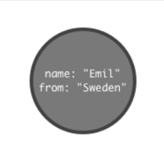

# LearningNeo4J

## Content

1. [Graph Fundamentals](#graph-fundamentals)
2. [Neo4J](#neo4j)
    * [Query Language Cypher](#cypher)
    * [Application - Movie Graph](#application---movie-graph)
    * [Application - Northwind Graph](#application---northwind-graph)
    * [Recommendations](#recommendations)
3. [Index](#index)
3. [References](#references)

--------------------

## Graph Fundamentals

###### ***This notes below can be read on neo4J browser sandbox by type the command: :play concepts***

A graph database can store any kind of data using a few simple concepts:
1. **Nodes** - graph data records
2. **Relationships** - connect nodes
3. **Properties** - named data values

The simplest graph has just a single **node** with some named values called **Properties**:



Nodes are the name for data records in a graph and the data is stored as Properties that can be simple name/value pairs.

Nodes can be grouped together by applying a Label to each member. In the example above we can set to that node the label **Person**.  Is important to know that a label is not a object and can't have any properties, is used only to categorize the nodes in a graph. A node can have zero or more labels based on the definition of that node.

To add more records we can simply add more nodes.


Similar nodes can have different properties with different type: string, number or even boolean.
The dimension of a graph like this can be infinite because there is no limit to the number of nodes that can be added.

One of the properties of a database is to connect data, in a graph database the link is made by **Relationships**. To associate two nodes we can add **Relationship** between them wich describe how the records are related.


A relationship are data records that need to have two properties: **direction** and **type**, and can also contains properties like nodes.


----------------

## Neo4J

### Cypher

###### ***This notes below can be read on neo4J browser sandbox by type the command: :play cypher***
###### ***All of the query are run in the [Neo4J browser sandbox](https://neo4j.com/sandbox-v2)***

Neo4J's Cypher language is purpose built for working with graph data. It uses patterns to describe graph data and is familiar to sql-like clauses, this language follow this rule: ***describing what to find and not how to find it***.

Let's create a small social graph using this query language.
To create a new data we use the **CREATE** clause:

```Cypher
CREATE (ee:Person {name: "Emil", from: "Sweden", klout:99})
```
***klout = influence based on the ability to drive action across the social web***

With this query we create a node **ee** of type Person that have 3 properties: name, from and klout.

The output of this query will be:
```
Added 1 label, created 1 node, set 3 properties, completed after 134 ms.
```

To find a node we can use the **MATCH** clause follow by a filters and conditions of nodes and relationships:
```Cypher
MATCH (ee:Person) WHERE ee.name = "Emil" RETURN ee;
```
Take the nodes label Person and return only the nodes that have a property name with the value **Emil**. To explain step by step:
- **MATCH** -> clause to specify a pattern of nodes and relationships
- **(ee:Person)** -> a single node pattern with label Person which will assign matches to the variable **ee**
- **WHERE** -> clause to filter the results
- **ee.name = "Emil"** -> compare name property to the value "Emil"
- **RETURN** -> clause used to request particular results

The output of this query can be different:
- by **graph**:


- by **table**:
```Json
{
    "name": "Emil",
    "from": "Sweden",
    "klout": 99
} 
```
- by **text**:
```
╒══════════════════════════════════════════╕
│"ee"                                      │
╞══════════════════════════════════════════╡
│{"name":"Emil","from":"Sweden","klout":99}│
└──────────────────────────────────────────┘ 
```

**Create** clauses can create many nodes and relationships at once:
```Cypher
MATCH (ee:Person) WHERE ee.name = "Emil"
CREATE 
(js:Person {name:"Johan", from:"Sweden", learn:"surfing"}),
(ir:Person {name:"Ian", from:"England", title:"author"}),
(rvb:Person {name:"Rik", from:"Belgium", pet:"Orval"}),
(ally:Person {name:"Allison", from: "California", hobby: "surfing" }),
(ee)-[:KNOWS {since: 2001}]->(js),
(ee)-[:KNOWS {rating:5}]->(ir),
(js)-[:KNOWS]->(ir), (js)-[:KNOWS]->(rvb),
(ir)-[:KNOWS]->(js), (ir)-[:KNOWS]->(ally),
(rvb)-[:KNOWS]->(ally)
```
If exits in the database a node with **name** property with value **Emil** then create 4 new nodes and 7 relationship between them.
The relationships are created by defined the left node and the right node:
```Cypher
(left_node)-[:NAME_OF_RELATIONSHIP {name_of_property: value_of_property}]->(right_node)
```
The output of the query above is:
```Text
Added 4 labels, created 4 nodes, set 14 properties, created 7 relationships, completed after 33 ms.
```

To see what we created we need to run a new query that take all of the nodes in relationship with **Emil**:
```Cypher
MATCH (ee:Person)-[:KNOWS]-(friends) 
WHERE ee.name="Emil"
RETURN ee.name, friends
```
Analyze this clause `MATCH (ee:Person)-[:KNOWS]-(friends)`, the meaning of `()-[:KNOWS]-()` is to maches **KNOWS** relationship in either direction and takes all nodes with label Person that have a relationship with other nodes.
The output will be all the relationships between node **ee** with property name set as Emil and nodes **friends**, the query graph result will be:


Pattern matching can be used to make recommendations, to suggest a new friend or a new film to watch. For example we can make recomandation to johan that is learning to surf, he may want to find a new frend who already does:
```Cypher
MATCH (js:Person)-[:KNOWS]-()-[:KNOWS]-(surfer)
WHERE js.name = "Johan" AND surfer.hobby = "surfing"
RETURN DISTINCT surfer
```
The clause **DISTINCT** is use to avoid an output of the same nodes because more than one Person can be friend to the same Person at the same time more than one nodes can be related to the same node.
The pattern put on the **MATCH** clause contains 2 relations and the nodes in the center `()` is not important in our recommendation so is ignored and not referred with a name.
This query return all of the Person who have the hobby "surfing" that are connected to a friend of a friend of Johan. In our database only one node correspond to this filter: "Allison".


To understand how the query works you can use the **EXPLAIN** or **PROFILE** clause put at the beginning of the query, like this:
```Cypher
PROFILE MATCH (js:Person)-[:KNOWS]-()-[:KNOWS]-(surfer)
WHERE js.name = "Johan" AND surfer.hobby = "surfing"
RETURN DISTINCT surfer
```
The outcome will be a cause effect of how the engine find the result.

### Application - Movie Graph

Let's create a more complex example with a mini application containing actors and directors that are related through the movies they've collaborated on.

We can create more than one nodes and relationships with a single block query statement composed of multiple **CREATE** clauses:
```Cypher
CREATE (TheMatrix:Movie {title:'The Matrix', released:1999, tagline:'Welcome to the Real World'})
CREATE (Keanu:Person {name:'Keanu Reeves', born:1964})
CREATE (Carrie:Person {name:'Carrie-Anne Moss', born:1967})
CREATE (Laurence:Person {name:'Laurence Fishburne', born:1961})
CREATE (Hugo:Person {name:'Hugo Weaving', born:1960})
CREATE (LillyW:Person {name:'Lilly Wachowski', born:1967})
CREATE (LanaW:Person {name:'Lana Wachowski', born:1965})
CREATE (JoelS:Person {name:'Joel Silver', born:1952})
CREATE
  (Keanu)-[:ACTED_IN {roles:['Neo']}]->(TheMatrix),
  (Carrie)-[:ACTED_IN {roles:['Trinity']}]->(TheMatrix),
  (Laurence)-[:ACTED_IN {roles:['Morpheus']}]->(TheMatrix),
  (Hugo)-[:ACTED_IN {roles:['Agent Smith']}]->(TheMatrix),
  (LillyW)-[:DIRECTED]->(TheMatrix),
  (LanaW)-[:DIRECTED]->(TheMatrix),
  (JoelS)-[:PRODUCED]->(TheMatrix)
```
***You can find all the query block here: [Cypher/MovieGraph/createGraph.cql](Cypher/MovieGraph/createGraph.cql)***
#### ***Source query of movie graph -> [here](/Cypher/MovieGraph/)***

The script add lot of nodes with relative relationships and properties, with this we can test some query:
1. Find the actor named "TOM Hanks"
    ```Cypher
    MATCH (tom {name: "Tom Hanks"})
    RETURN tom
    ```
    or 
    ```Cypher
    MATCH (tom:Person)
    WHERE tom.name="Tom Hanks"
    RETURN tom
    ```
2. Find the movie with title "Cloud Atlas"
    ```Cypher
    MATCH (cloud:Movie)
    WHERE cloud.title="Cloud Atlas"
    RETURN cloud
    ```
    or
    ```Cypher
    MATCH (cloud:Movie {title: "Cloud Atlas"})
    RETURN cloud
    ```
3. Find 10 people
    ```Cypher
    MATCH (people:Person)
    RETURN people.name
    LIMIT 10
    ```
    The ***LIMIT*** clause is use to limitate the number of nodes in output.
3. Find movies released in the 1990s
    ```Cypher
    MATCH (movie:Movie)
    WHERE movie.released >= 1990 AND movie.released < 2000
    RETURN movie.title
    ```
3. Find the films where "Tom Hanks" acted and show the director of the film
    ```Cypher
    MATCH (tom:Person)-[:ACTED_IN]->(movie)<-[:DIRECTED]-(dir)
    WHERE tom.name = "Tom Hanks"
    RETURN tom,movie,dir
    ```
    graph result:

    
3. List of Tom Hanks movies
    ```Cypher
    MATCH (tom:Person {name: "Tom Hanks"})-[:ACTED_IN]->(movie)
    RETURN tom,movie
    ```
    graph result:

    
3. Who directed "Cloud Atlas"
    ```Cypher
    MATCH (dir:Person)-[:DIRECTED]->(movie)
    WHERE movie.title = "Cloud Atlas"
    RETURN dir
    ```
3.  Tom Hanks co-actor (actor in the same film)
    ```Cypher
    MATCH (tom:Person {name: "Tom Hanks"})-[:ACTED_IN]->(movie)
    WHERE film.title = "Cloud Atlas"
    RETURN dir
    ```
3. How people are related to "Cloud Atlas"
    ```Cypher
    MATCH (people:Person)-[relatedTo]-(:Movie {title: "Cloud Atlas"})
    RETURN people.name,Type(relatedTo),relatedTo
    ```
    The *Type()* is use to get the type of nodes or relationships.
3. Movies and actors up to 4 "hops" away from Kevin Bacon
    ```Cypher
    MATCH (bacon:Person {name: "Kevin Bacon"})-[*1..4]-(person)
    RETURN DISTINCT person
    ```
    The result of this query block count 135 nodes and 180 relationships.
3. Kevin Bacon the shortest path of any relationships to Meg Ryan
    ```Cypher
    MATCH p=shortestPath(
        (bacon:Person {name: "Kevin Bacon"})-[*]-(meg:Person {name: "Meg Ryan"})
    )
    RETURN p
    ```
    Result graph:

    

    The **shortestPath({}-[]-{})** is a function that take a relation of 2 nodes and return the shortest path from them.

    ###### ***To know more about the shortest path problem you can visit the wikipedia page: https://en.wikipedia.org/wiki/Shortest_path_problem***
3. Extend Tom Hanks co-actors, to find co-co-actors who haven't worked with Tom Hanks
    ```Cypher
    MATCH (tom:Person {name: "Tom Hanks"})-[:ACTED_IN]->()<-[:ACTED_IN]-(coactor:Person),
        (coactor)-[:ACTED_IN]->()<-[:ACTED_IN]-(cocoactor:Person)
    WHERE NOT (tom)-[:ACTED_IN]->()<-[:ACTED_IN]-(cocoactor) AND tom <> cocoactor
    RETURN cocoactor.name AS Racommended, count(*) AS Strength ORDER BY Strength DESC
    ```
3. Find someone to introduce Tom Hanks to Tom Cruise
    ```Cypher
    MATCH (tomh:Person {name: "Tom Hanks"})-[]->(movie)<-[]-(someone:Person),
        (someone)-[]->(movie2)<-[]-(tomc:Person {name: "Tom Cruise"})
    RETURN tomh,movie, someone,movie2, tomc
    ```
    Result graph:

    

Let's now clean the graph by delete all the nodes and relationships:
```Cypher
MATCH (n) 
DETACH 
DELETE n
```
With this the engine take all the nodes, for every one it detach from any relationships and then delete it.
To be sure and prove that the graph is gone the query is:
```Cypher
MATCH (n) 
RETURN n
```

#### ***All the query above is on the source directory of Cypher [here](/Cypher/MovieGraph/)***

### Application - Northwind Graph

This application demostrates how to migrate from a relational database to Neo4j, to do this we need to transform all the data on th relational tables to the nodes and relationships of a graph.
Pratically how to get this:


From this:


This example is a sellers of food products for a few categories provided by suppliers. The database actually in use is a relational table of product catalog. The first step to transform this is with the `LOAD CSV` clause that retrive a CSV file from a valid URL and create a named map:
* Products nodes:
    ```Cypher
    LOAD CSV WITH HEADERS FROM "http://data.neo4j.com/northwind/products.csv" AS row
    CREATE (n:Product)
    SET n = row,
        n.unitPrice = toFloat(row.unitPrice),
        n.unitinStock = toInteger(row.unitsInStock), n.unitOnOrder = toInteger(row.unitsOnOrder),
        n.reorderLevel = toInteger(row.reorderLevel), n.discontinued = (row.discontinued <> "0")
    ```
* Categories nodes:
    ```Cypher
    LOAD CSV WITH HEADERS FROM "http://data.neo4j.com/northwind/categories.csv" AS row
    CREATE (n:Category)
    SET n = row
    ```
* Suppliers nodes:
    ```Cypher
    LOAD CSV WITH HEADERS FROM "http://data.neo4j.com/northwind/suppliers.csv" AS row
    CREATE (n:Supplier)
    SET n = row
    ```
It's important to define an index for a node with the purpose of making searches of related data more efficent:
* Product index:
    ```Cypher
    CREATE INDEX ON :Product(productID)
    ```
* Category index:
    ```Cypher
    CREATE INDEX ON :Category(productID)
    ```
* Supplier index:
    ```Cypher
    CREATE INDEX ON :Supplier(productID)
    ```

This 3 type of nodes are related one to another with foreign keys references we can use this properties to create the relationships from node to node.
A product is a part of a category and a supplier supplies product, let's create this two relationship:
* Product-part_of->Category:
    ```Cypher
    MATCH (p:Product), (c:Category)
    WHERE p.categoryID = c.categoryID
    CREATE (p)-[:PART_OF]->(c)
    ```
* Supplier-supplies->Product:
    ```Cypher
    MATCH (p:Product), (s:Supplier)
    WHERE p.supplierID = s.supplierID
    CREATE (s)-[:SUPPLIES]->(p)
    ```

We can now test what we crated:
1. List the product categories proviced by each supplier:
    ```Cypher
    MATCH (s:Supplier)-[*]->(c:Category)
    RETURN 
        s.companyName as Company,
        collect(distinct c.categoryName) as Categories
    ORDER BY Company DESC
    ```
2. Find the produce suppliers:
    ```Cypher
    MATCH (s:Supplier)-[*]->(c:Category {categoryName: "Produce"})
    RETURN DISTINCT s.companyName as ProduceSuppliers
    ```

We can expand this graph with more datas and infos about Orders and Costumers:


We can do the same thing we had before to load and index the records:
* Customers nodes
    ```Cypher
    LOAD CSV WITH HEADERS FROM "http://data.neo4j.com/northwind/customers.csv" AS row
    CREATE (n:Customer)
    SET n = row
    ```
* Orders nodes
    ```Cypher
    LOAD CSV WITH HEADERS FROM "http://data.neo4j.com/northwind/orders.csv" AS row
    CREATE (n:Order)
    SET n = row
    ```
* Index customer
    ```Cypher
    CREATE INDEX ON :Customer(customerID)
    ```
* Index order
    ```Cypher
    CREATE INDEX ON :Order(orderID)
    ```
* Create relationship customer-purchased-order
    ```Cypher
    MATCH 
        (c:Customer),
        (o:Order)
    WHERE c.customerID = o.customerID
    CREATE (c)-[:PURCHASE]->(o)
    ```
Notice that the Order Details are always part of an Order and are the description of the relation between an order and a product, this is a sign of a data relationship indicating shared information between two other records:
```Cypher
LOAD CSV WITH HEADERS FROM "http://data.neo4j.com/northwind/order-details.csv" AS row
MATCH (p:Product), (o:Order)
WHERE 
    p.productID = row.productID AND
    row.orderID = o.orderID
CREATE (o)-[details:ORDERS]->(p)
set details = row,
    details.quantity = toInteger(row.quantity)
```
Example of query:
* List of costumers with the number of products purchased for the Produce category:
```Cypher
MATCH 
    (c:Customer)-[:PURCHASED]->(:Order)-[o:ORDERS]->(p:Product),
    (p)-[:PART_OF]->(cat:Category {categoryName: "Produce"})
RETURN DISTINCT
    c.contactName AS CustomerName,
    SUM(o.quantity) AS TotalProductsPurchased
```

### Recommendations

###### ***This paragraph is referred to recommedation application on neo4j browser.***
###### It is possible to recreate this database using the open movie database here -> [www.omdbapi.com](https://www.omdbapi.com/)
###### for more -> [https://movielens.org/](https://movielens.org/) and [https://grouplens.org/datasets/movielens/](https://grouplens.org/datasets/movielens/)

Personalized product recommendations can increase conversions, improve sales rates and provide a better experice for users. 
This paragraph take a look at how generate graph-based real-time personalized product recommendations using a dataset of movies and movie ratings.
All of this techniques can also apply through many different types of products or content.

Generating personalized recommendations is one of the most common use cases for a graph database and there are some benefits of using a graph to generate racommendations:
* Performance -> [index-free adjacency](#index-free-adjacency) allows for calculating recommendations in real time, ensuring the recommendation is always relevant and reflecting up-to-date information.
* Data model -> The labeled property graph model allows for easily combining datasets from multiple sources allowing enterprises to unlock value from previously separated data silos.

For this paragraph will use a graph movie with default node-relationships-node template:


## Index

### index-free adjacency
<!-- 
* https://medium.com/@dmccreary/how-to-explain-index-free-adjacency-to-your-manager-1a8e68ec664a 
* https://en.wikipedia.org/wiki/Talk:Graph_database#No_indexes?
* https://www.arangodb.com/2016/04/index-free-adjacency-hybrid-indexes-graph-databases/
-->
A graph database is any storage system that provides index-free adjacency and this means that every element contains a direct pointer to its adjacent element and no index lookups are necessary. 
This is one of the most element of distinction from relational databases that are based on a key-value store.
The idea of an index-free adjacency is analogous to that of a pointer where the time to follow the relationship is O(1) with respect to the size of the graph, and this is not the cost of found a relationship in a relational.
To be more precise a relational database use indexes but the aren't used for adjacency or link purposes.
With Neo4j tipically a query will find the node to start from with an index and then the resto fo the query simply follows relationships to compute the answer.
When create a new set of nodes it's typical to create an index of that type, see [northwind graph](#Application-Northwind-Graph), this reduce the cost of every query run.
Example:


In a relational database if we want to switch from data **A** to data **B** the step are:
1. The db prohibited you to access direct items via pointers, so you need to ask for the permission.
2. The request permission line can be full of other request, wait for your turn.
3. The central index of db search for the data you want in a list of other data , the cost of search is O(n) with **n** number of the data stored.
4. Once you get the memory pointer of that data you can go to **B** by follow the memory allocations by hopping on memory.
5. The cost of this hopping is O(n), but at the end you can switch to **B** and do your operations.

In a graph database like Neo4j all the nodes are connected to each other by relationships, so in order to go from **A** to **B**:
1. Get the relationships pointer
2. Point to node **B** wherever the type of the relationships are
3. Do operations on **B**

The cost in this case is O(1), a big difference in performance between a classical relational db.

-----------------------

### References 
- [neo4j browser sandbox](https://neo4j.com/sandbox-v2)
    * :play concepts
    * :play intro
    * :play cypher
    * :play movie-graph
    * :play northwind-graph
    * Racommendations -> :play https://guides.neo4j.com/sandbox/recommendations/index.html
- [neo4j developer manual](https://neo4j.com/docs/developer-manual/3.2/)
