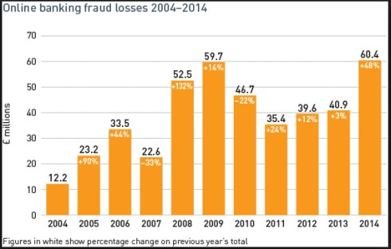
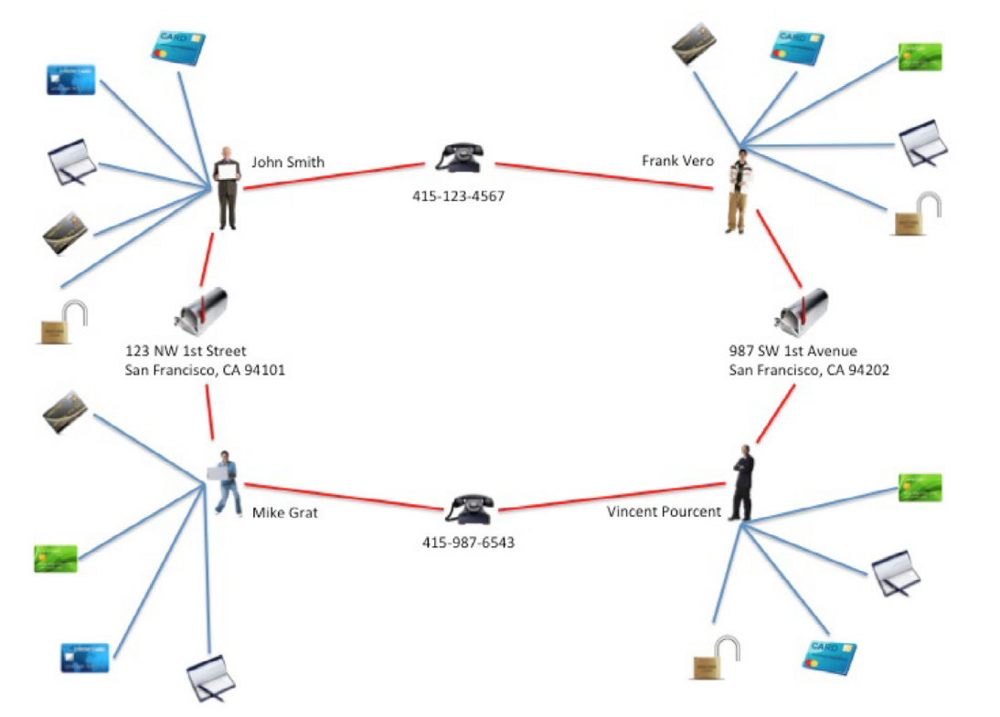

# Fraud Detection with Graph Databases

A fraud is commonly undestood as dishonesty calculated for advantage. This kinds of actions represent one of the most significant losses for banks and insurance companies with billions of dollars every year. Detect have an important role to minimizing the losses.

Graph database, like Neo4j, offer a new method to help detection of this fraud by analyze the connections between old datas and new one. Graph are design to be clear and easy and can uncover patters that are difficult to detect with the traditional methods. The prevention using this method can make evasion more difficult.

## First-party bank fraud

First introduce the definition of _First-party bank fraud_.

When agencies offer goods, services or anything of value to the public it's possible to incur in risk, these include:

* Credit risk -> this kind of risk arise when an individual receives somethings in exchange for a promise of future repayment, but if the individual circumstances change in a way that prevents him/her from paying as agreed, the provider may not receive full payment and will incur a loss.
* Fraud risk -> this happend when the user obtain the goods or services but he/she is not going to return that amount.

The difference between this two risk is intent. An hybrid form of risk between this two is called Frist-party bank fraud, first party fraud involves fraudsters who makes a promise of future repayment in exchange for goods/service without the intent to repay.

The magnitude of these losses is likely the result of two factors: the first-party fraud is very difficult to detect because fraudsters behave are very similar to legitimate customers until the moment they cleaning out all their accounts, the exponential nature of the relationship between the number of partecipants in the fraud and the dollar value of the operations. This caracteristic makes these schemes potentially very damaging, it also renders them particularly susceptible to graph-based methods of fraud detection.

For operational management it is necessary to choose between two possible solutions both not too easy to apply:

* First-party fraud is included in the credit risk, but this results in an impossibility to distinguish between the risks.
* First-party fraud is included with other fraud types, the investigation and analysis made to identification of fraud cannot work for First-party fraud. That's because the fraudsters of first-party always provide complete and acucrate information upon contact, and all the transaction/purchase is legittimate. The result will be a distorted view of their fraud losses and misconceptions about the effectiveness of their investigative process.

The best practice for analyzing this type of risk are to extract more granular details and let study these by a dedicated team that can be focused on this issue. This approch allows the create clear rules to govern the management of the risk and its prevention, also it helps insulate good customers from the impact of the fraud review process.

### Typical scenario

> _This example is take from neo4j fraud detection guide_

The main pattern of how works fraud rings is this one:

* A group of two or more people organize into a fraud ring
* The ring share infos
* Members open accounts using these identities
* New accounts are added to the original ones
* The accounts are used normally
* Bank increase the revolving credit lines over time due to the behavior of the account
* In one day the ring break and disappear
* Sometimes fraudsters bring all of their balances to zero using fake checks
* Collections of all datas
* The debt is written off

Our scenario is composed by 2 people colluding to create synthetic identities:

1. Tony Bee lives at 123 NW 1st Street, San Francisco, CA 94101 (his real address) and gets a prepaid phone at 415-123-4567
2. Paul Favre lives at 987 SW 1st Ave, San Francisco, CA 94102 (his real address) and gets a prepaid phone at 415-987-6543

With sharing only phone number and address, they can combine these to create 4 identities with fake names:

-----

Resources:

* [Neo4j - fraud detection: Discovering connections with graph databases](https://go.neo4j.com/rs/710-RRC-335/images/Neo4j_WP-Fraud-Detection-with-Graph-Databases.pdf)
* [Hybrid risk first party fraud](https://www.experian.com/blogs/insights/2015/10/hybrid-risk-the-truth-behind-first-party-fraud/)
* [Fraud definition](https://legal-dictionary.thefreedictionary.com/Fraud)
